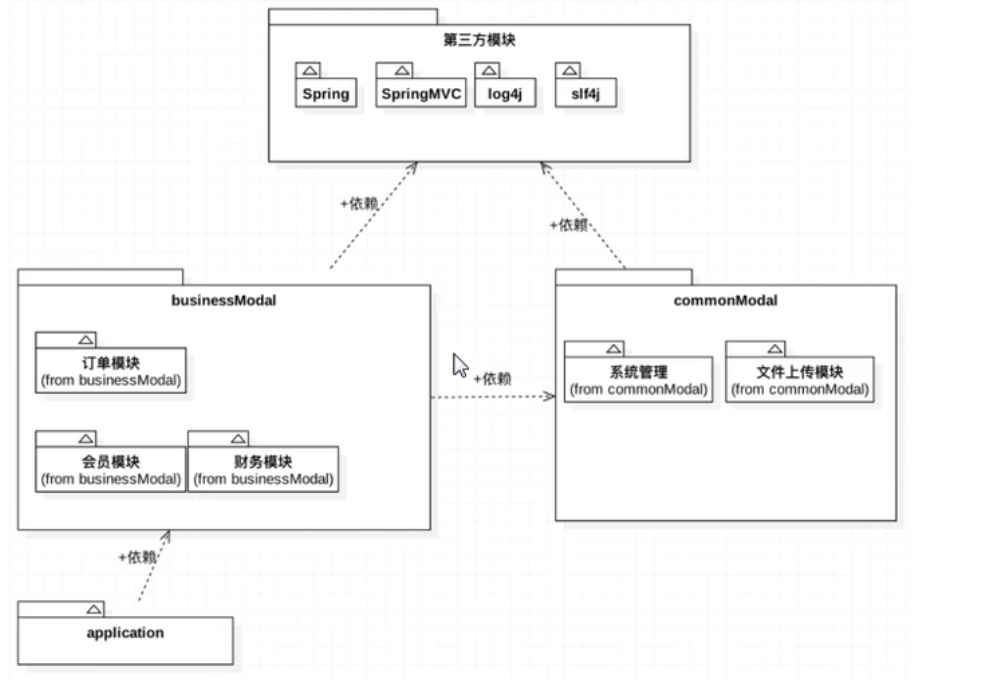

[toc]

# Maven 自动化构建工具

## 软件是一个工程

- 我们在日常生活常能听到工程这个词，像桥梁工程、道路工程、南水北调工程等等。 工程说简单点就是各个行业的从业人员通过总结规律或者方法，以最短的时间和人力、物力来做出高效可靠 的东西。我们也就能理解桥梁工程，其实就是人们通过经验的总结和各种研究得出来的、用来修建桥梁时所采用 的高效的方法，当然这种方法是可复用的。我们将这种作工程的思想应用到软件上，于是就产生了—软件工程。
- 软件工程：**为了能够实现软件的流水线式生产，在设计和构建软件时能够有一种规范和工程化的方法，人们 便提出了软件工程概念。**
  - 上面的内容做个日常生活的类比，做道菜就是一个工程。今天心情好，想吃红烧肉，自动动手做：
    1. 想买什么猪的那个位置的肉，黑猪肉，土猪肉等，使用冰糖还是绵白糖，用什么牌子的酱油等
    2. 到菜市场购买各种原料。
    3. 准备材料，洗肉，切块，花椒，大料等 
    4. 开始做了，肉下锅炖煮，不同时间加入花椒，大料，冰糖，酱油
    5. 炖煮一段时间后，看肉是否熟透，尝试口味，是不是咸了等等
    6. 做好了，开始吃了
    7. 需要刷碗，倒垃圾
- 这些工作从头做到尾步骤非常繁琐，每个步骤都是费时费力的。所以才出现净菜，半成品菜，拿回家直接做 可以了，只做 6,7 步骤就可以 。
- 软件开发需要编译代码—>开发人员自己测试代码—>把代码打包—>部署项目到测试服务器—>测试人员测试 功能—>测试测试出 bug—>开发人员需要修改bug—>开发人员自己测试代码—>把代码打包—>部署项目到测试服务器—>测试人员测试功 能—>直到符合功能要求。
- 上述过程需要重复多次，大型项目中构建项目比较复杂，有很多的配置文件，jar 文件，多个子项目等等。都 用人力完成费时费力，效率比较低。maven 可以让我们从上面的工作中解脱出来。
- maven 是自动化构建工具。


## 传统项目开发存在的问题

- 一个项目做成一个工程，造成工程比较庞大，需要使用多模块来划分项目； 
- 项目中需要的数量众多的 jar 包，需要手动下载并引入，并且多个项目需要的 jar 包存在重复的问题； 
- 项目中需要的 jar 包有版本兼容的问题，需要手动解决； 
- 项目中需要的 jar 包又依赖其它的 jar 包，需要手动解决。


## Maven概述

- Maven 是 Apache 软件基金会组织维护的一款自动化构建工具，专注服务于 Java 平台的项目构建和 依赖管理。Maven 这个单词的本意是：专家，内行。读音是['meɪv(ə)n]或['mevn]。
- Maven 是目前最流行的自动化构建工具，对于生产环境下多框架、多模块整合开发有重要作用，Maven 是一 款在大型项目开发过程中不可或缺的重要工具。
  - Maven 可以整合多个项目之间的引用关系，我们可以根据业务和分层需要任意拆分一个项目； 
  - Maven 提供规范的管理各个常用 jar 包及其各个版本，并且可以自动下载和引入项目中； 
  - Maven 可以根据指定版本自动解决 jar 包版本兼容问题； 
  - Maven 可以把 jar 包所依赖的其它 jar 包自动下载并引入项目。
  - 类似自动化构建工具还有：Ant, Maven, Gradle。

## Maven的主要功能

- ## 开发和管理

  1. maven可以管理jar文件
  2. 自动下载jar和他的文档，源代码
  3. 管理jar直接的依赖， a.jar需要b.jar ， maven会自动下载b.jar
  4. 管理你需要的jar版本
  5. 帮你编译程序，把java编译为class
  6. 帮你测试你的代码是否正确。
  7. 帮你打包文件，形成jar文件，或者war文件
  8. 帮你部署项目

- ## 构建项目

  - 构建过程中的各个环节：清理、编译、测试、报告、打包、安装、部署。
  - 构建（build），项目的构建，是面向过程的(从开始到结尾的多个步骤)，涉及到多个环节的协同工作。
  - 构建过程的几个主要环节
    1. 清理：把之前项目编译的东西删除掉，我新的编译代码做准备。 
    2. 编译：将Java源程序编译为字节码文件。把程序源代码编译为执行代码， java-class文件。批量的，maven可以同时把成千上百的文件编译为class。
    3. 测试：针对项目中的关键点进行测试，确保项目在迭代开发过程中关键点的正确性。 maven可以执行测试程序代码，验证你的功能是否正确，批量的，maven同时执行多个测试代码，同时测试很多功能。
    4. 报告：在每一次测试后以标准的格式记录和展示测试结果。
    5. 打包：将一个包含诸多文件的工程封装为一个压缩文件用于安装或部署。Java 工程对应 jar 包，Web 工程对应war包。
    6. 安装：在Maven环境下特指将打包的结果——jar包或war包安装到本地仓库中。
    7. 部署：将打包的结果部署到远程仓库或将war包部署到服务器上运行

  

  ## Maven的使用

  1. 独立使用Maven：使用Maven的各种命令，完成代码的编译，测试，打包等
  2. 结合开发工具使用，一般在idea中使用Maven：简单，跨界，不需要记命令


# Maven核心概念

## Maven的核心概念

- 想要用好maven，需要了解这些概念
  1. POM： 一个文件 名称是pom.xml ,  pom翻译过来叫做项目对象模型。  maven把一个项目当做一个模型使用。控制maven构建项目的过程，管理jar依赖。
  2. 约定的目录结构：maven项目的目录和文件的位置都是规定的。
  3. 坐标：是一个唯一的字符串，用来表示资源的。
  4. 依赖管理：管理你的项目可以使用jar文件
  5. 仓库管理【了解】：你的资源存放的位置
  6. 生命周期【了解】： maven工具构建项目的过程，就是生命周期。
  7. 插件和目标【了解】：执行maven构建的时候用的工具是插件
  8. 继承
  9. 聚合

## 安装Maven环境

1. 确保安装了 java 环境:maven 本身就是 java 写的，所以要求必须安装 JDK。

   查看 java 环境变量：echo %JAVA_HOME%

2. 下载并解压 maven 安装程序： http://maven.apache.org/download.cgi

3. 配置 Maven 的环境变量：

   - MAVEN_HOME=d:/apache-maven-3.3.9 或者 M2_HOME=d:/apache-maven-3.3.9
   - path=%MAVEN_HOME%/bin; 或者%M2_HOME%/bin;

4. 验证是否安装成功

   - mvn -v


## Maven工程约定目录结构

- Maven中约定的目录结构，约定是大家都遵循的一个跪着

- 每一个Maven项目都在磁盘中都是一个文件夹（假设项目-Hello）

  - Hello/

    ​	---/sec

    ​	------/main	（放的是你的主程序Java代码和配置文件）

    ​	---------/java	（你的程序包和包中的Java文件）

    ​	---------/resources	（你的Java程序中要使用的配置文件）

    

    ​	------/text	（放的是测试程序代码和文件，可以没有）

    ​	---------/java	（测试程序包和包中的Java文件）

    ​	---------/resources	（测试Java程序中要使用的配置文件）

    

    ​	---/pom.xml	（Maven的核心文件，Maven项目必须有）


## 第一个Maven工程

按照如下步骤，实现第一个 maven 项目，以 maven 推荐的约定方式创建目录，类文件。 

1. 某个目录中创建文件夹 Hello 
2. 在 Hello 中创建子目录 src 
3. 拷贝 pom.xml 到 Hello 目录和 src 是同级放置的。 
4. 进入 src 目录，创建 main， test 目录 
5. 进入 main 目录，创建 java，resources 目录。 
6. 进入 java 目录，创建目录 com/bjpowernode/ 
7. 在 com/bjpowernode/目录下创建 HelloMaven.java 文件，定义 int addNumber(int n1,n2){ return n1+n2}; 定义 public static void main(String args[]) { System.out.prinltn(“Hello Manven”); //也可以调用 addNumber()方法 } 
8. 进入到 Hello 目录在，执行 mvn compile  8.进入到 target/classes 目录执行 java com.bjpowernode.HelloMaven


## POM文件

即 Project Object Model 项目对象模型。Maven 把一个项目的结构和内容抽象成一个模型，在 xml 文件中 进行声明，以方便进行构建和描述，pom.xml 是 Maven 的灵魂。所以，maven 环境搭建好之后，所有的学习和 操作都是关于 pom.xml 的。

**基本信息**

- modelVersion：Maven 模型的版本，对于 Maven2 和 Maven3 来说，它只能是 4.0.0
- groupId：组织 id，一般是公司域名的倒写。 格式可以为： 1. 域名倒写。 例如 com.baidu 2. 域名倒写+项目名。例如 com.baidu.appolo
- artifactId：项目名称，也是模块名称，对应 groupId 中 项目中的 子项目。
- version：项目的版本号。如果项目还在开发中，是不稳定版本， 通常在版本后带-SNAPSHOT version 使用三位数字标识，例如 1.1.0
- **坐标（gav）：**groupId 、 artifactId 、 version 三个元素生成了一个 Maven 项目的基 本坐标，在众多的 maven 项目中可 以唯一定位到某一 个项目。坐标也决 定着将来项目在仓库中的路径及名称。这个坐标是可以在中央仓库官网找到，复制粘贴即可。
- packaging：项目打包的类型，可以使 jar、war、rar、ear、pom，默认是 jar

**依赖**

- dependencies 和 dependency：Maven 的一个重要作用就是管理 jar 包，为了一个项目可以构建或运行，项 目中不可避免的，会依赖很多其他的 jar 包，在 Maven 中，这些 jar 就被称 为依赖，使用标签 dependency 来配置。而这种依赖的配置正是通过坐标来 定位的，由此我们也不难看出，maven 把所有的 jar 包也都视为项目存在了。

**配置属性**

- properties：properties 是 用 来 定 义 一 些 配 置 属 性 的 ， 例 如 project.build.sourceEncoding（项目构建源码编码方式），可以设置为 UTF-8，防止中文乱码，也可定义相关构建版本号，便于日后统一升级。

**构建**

- build：build 表示与构建相关的配置，例如设置编译插件的 jdk 版本

**继承**

- parent ：在 Maven 中，如果多个模块都需要声明相同的配置，例如：groupId、 version、有相同的依赖、或者相同的组件配置等，也有类似 Java 的继承机 制，用 parent 声明要继承的父工程的 pom 配置。

**聚合**

- 在 Maven 的多模块开发中，为了统一构建整个项目的所有模块，可以提供一 个额外的模块，该模块打包方式为 pom，并且在其中使用 modules 聚合的 其它模块，这样通过本模块就可以一键自动识别模块间的依赖关系来构建所有 模块，叫 Maven 的聚合。


## Maven仓库的概念

在Maven中，任何一个依赖、插件或者项目构建的输出，都可以称之为构件。Maven 核心程序仅仅定义了自动化构建项目的生命周期，但具体的构建工作是由特定的构件完成的。而且为了提高构建 的效率和构件复用，maven把所有的构件统一存储在某一个位置，这个位置就叫做仓库。

- ## 仓库存什么

  - Maven 的插件，插件也是一些 jar，这些 jar 可以完成一定的功能。 
  - 我们自己开发项目的模块 
  - 第三方框架或工具的 jar 包

- ## 仓库的类别

  - 本地仓库：
    - 存在于当前电脑上,默认存放在~\.m2\repository中,为本机上所有的Maven工程服务。你也可以 通过Maven的配置文件Maven_home/conf/settings.xml中修改本地仓库所在的目录。 
    - ~ 是用户的主目录，windows系统中是 c：/user/登录系统的用户名
  - 远程仓库：
    - 中央仓库，包含了绝大多数流行的开源Java构件，以及源码、作者信息、许可证信息等。一般来说，简单的 Java项目依赖的构件都可以在这里下载得到。其地址是:http://repo.maven.apache.org/maven2/
    - 中央仓库的镜像：就是中央仓库的备份，在各大州，重要的城市都是镜像。
    - 私服是一种特殊的远程仓库，它是架设在局域网内的仓库服务，私服代理广域网上的远程仓库，供局域网内的 Maven用户使用。当Maven需要下载构件的时候，它从私服请求，如果私服上不存在该构件，则从外部的远程仓 库下载，缓存在私服上之后，再为Maven的下载请求提供服务。我们还可以把一些无法从外部仓库下载到的构件 上传到私服上。

- ## Maven仓库的使用

  - 在 Maven 构建项目的过程中如果需要某些插件，首先会到 Maven 的本地仓库中查找，如果找到则可以直接 使用；如果找不到，它会自动连接外网，到远程中央仓库中查找；如果远程仓库中能找到，则先把所需要的插件 下载到本地仓库，然后再使用，并且下次再用到相同的插件也可以直接使用本地仓库的；如果没有外网或者远程 仓库中也找不到，则构建失败。
  - 这种使用是和我们没有关系的，Maven苍井优的使用不需要认为参与。  


## Maven的常用命令

- Maven三大功能：管理依赖，构建项目，管理项目信息。管理依赖，只需要声明就可以自动到仓库下载；管理项目信息其实就是生成一个站点文档，一个命令就可以解决，最后再说，Maven功能主题其实就是项目的构建

- Maven 提供一个项目构建的模型，把编译、测试、打包、部署等都对应成一个个的生命周期阶段，并对 每一个阶段提供相应的命令，程序员只需要掌握一小堆命令，就可以完成项目的构建过程。
- 常用命令
  - mvn clean 清理(会删除原来编译和测试的目录，即 target 目录，但是已经 install 到仓库里的包不会删除)
  - mvn compile 编译主程序(会在当前目录下生成一个 target,里边存放编译主程序之后生成的字节码文件) 
  - mvn test-compile  编译测试程序(会在当前目录下生成一个 target,里边存放编译测试程序之后生成的字节码文件) 
  - mvn test 测试(会生成一个目录surefire-reports，保存测试结果) 
  - mvn package 打包主程序(会编译、编译测试、测试、并且按照 pom.xml 配置把主程序打包生成 jar 包或者 war 包) 
  - mvn install 安装主程序(会把本工程打包，并且按照本工程的坐标保存到本地仓库中) 
  - mvn deploy 部署主程序(会把本工程打包，按照本工程的坐标保存到本地库中，并且还会保存到私服仓库中。 还会自动把项目部署到 web 容器中)。
  - **注意：执行以上命令必须在命令行进入 pom.xml 所在目录！并且在调用命令的时候，该命令之前的命令都会执行一遍**


## Maven插件

- Maven过程构建周期，由Maven的插件plugin来执行完成
- 官网插件说明：http://maven.apache.org/plugins/
- 在项目根目录下执：mvn clean install
- **clean 插件**
  - clean 阶段是独立的一个阶段，功能就是清除工程目前下的 target 目录
- **resources插件**
  - resource 插件的功能就是把项目需要的配置文件拷贝到指定的目当，默认是拷贝 src\main\resources 目录下的件到 classes 目录下
- **complie插件**
  - compile 插件执行时先调用 resouces 插件，功能就是把 src\mainjava 源码编译成字节码生成 class 文件，并把编译好 的 class 文件输出到 target\classes 目录下
- **text测试插件**
  - 单元测试所用的 compile 和 resources 插件和主代码是相同的，但执行的目标不行，目标 testCompile 和 testResources 是把 src\test\java 下的代码编译成字节码输出到 target\test-classes，同时把 src\test\resources 下的配置文件拷贝到 target\test-classes
- **package打包插件**
  - 这个插件是把 class 文件、配置文件打成一个 jar(war 或其它格式)包
- **deploy发布插件**
  - 发布插件的功能就是把构建好的 artifact 部署到本地仓库，还有一个 deploy 插件是将构建好的 artifact 部署到远程 仓库

# 在idea中应用Maven

- 在idea中设置Maven，让idea和Maven结合使用。

- idea中内置了Maven，但是我们一般不适用内置的，因为用内置修改Maven的设置不方便，所以一般使用自己安装的。

- 需要覆盖idea中默认的设置，让idea指定Maven安装位置等信息

- 要配置俩

  1. setting（配置当前工程的设置）
  2. other setting（配置以后工程的设置）20版本的之后的idea变成了new project setup

- 创建项目（module）

  - 选择创建Maven项目，同时勾选框架（方便点）
  - 使用模板框架创建项目
    - maven-archetype-quickstart : 普通的java项目
    - maven-archetype-webapp : web工程

- **依赖部分**

  - 介绍scope标签

    -  scope的值有 compile, test, provided ,默认是compile
    -  scope:表示依赖使用的范围，也就是在maven构建项目的那些阶段中起作用。
    -  maven构建项目  编译， 测试 ，打包， 安装 ，部署 过程（阶段）

  - 创建的如果是web工程

    - 应该添加相对应的servlet和jsp的依赖，就不用去导包进idea了

      ```xml
      <dependency>
       <groupId>javax.servlet</groupId>
       <artifactId>javax.servlet-api</artifactId>
       <version>3.1.0</version>
       <scope>provided</scope>
      </dependency>
      <dependency>
       <groupId>javax.servlet.jsp</groupId>
       <artifactId>jsp-api</artifactId>
       <version>2.1</version>
       <scope>provided</scope>
      </dependency>
      ```

  - 依赖的范围

    |                    | compile | test | provided |
    | ------------------ | ------- | ---- | -------- |
    | 对主程序是否有效   | √       |      | √        |
    | 对测试程序是否有效 | √       | √    | √        |
    | 是否参与打包       | √       |      |          |
    | 是否参与部署       | √       |      |          |

  - 你在写项目的中的用到的所有依赖（jar ） ，必须在本地仓库中有。
    没有必须通过maven下载， 包括provided的都必须下载。

  - 你在servlet需要继承HttpServlet( provided) , 你使用的HttpServlet是maven仓库中的。当你的写好的程序， 放到 tomat服务器中运行时， 此时你的程序中不包含servlet的jar因为tomcat提供了 servlet的.jar

## 创建完毕

- 到这如果一帆风顺的话，就创建完毕了，但是可能会有些许问题

- jdk版本，Maven是会看jdk版本的，在POM文件里面可以查看到项目编译代码使用的jdk版本和Maven运行程序所使用的jdk版本，这两个位置尽可能写一致的版本，不然会编译不通过

  ```xml
  <properties>
      <project.build.sourceEncoding>UTF-8</project.build.sourceEncoding>
      <maven.compiler.source>1.8</maven.compiler.source>
      <maven.compiler.target>1.8</maven.compiler.target>
    </properties>
  ```

  

- 创建web项目的时候，会出现tomcat版本不一致的问题。网上很多都是tomcat9之前，也就是servlet5.0和jsp3.0之前的，他们并不是jakarta作为文件目录，而是Javax，这个时候要多注意，如果用的tomcat10之后的，在POM文件配置的时候应该配置这些

  ```xml
  <!-- Servlet依赖 -->
  <dependency>
        <groupId>jakarta.servlet</groupId>
        <artifactId>jakarta.servlet-api</artifactId>
        <version>5.0.0</version>
        <scope>provided</scope>
  </dependency>
  
  <!-- JSP依赖 -->
  <dependency>
        <groupId>jakarta.servlet.jsp</groupId>
        <artifactId>jakarta.servlet.jsp-api</artifactId>
        <version>3.0.0</version>
        <scope>provided</scope>
  </dependency>
  ```

- 测试阶段测试的时候出现乱码问题，多半是编译时的编码方式错误，需要在Maven插件的配置中修改

```xml
<plugin>
	  <artifactId>maven-compiler-plugin</artifactId>
	  <version>3.8.0</version>
	  <!-- 在Maven的compiler插件的配置中加入下面的代码即可，改变编码方式 -->
	  <configuration>
		<encoding>utf-8</encoding>
	  </configuration>
</plugin>
```

- 可能会遇到Maven项目无法创建，创建异常的问题，这个问题大部分是因为idea版本，根据时间来看，idea的2021版本最高应该是Maven3.6.3，如果后面到idea2022可能就能使用maven3.8.6了


# Maven的常用操作

## 全局变量

1. maven的属性设置
   `  <properties>` 设置maven的常用属性

maven的全局变量

- 自定义的属性:

  - 在`<properties> `通过自定义标签声明变量（标签名就是变量名）
  - 在pom.xml文件中的其它位置，使用 ${标签名} 使用变量的值

  自定义全局变量一般是定义 依赖的版本号， 当你的项目中要使用多个相同的版本号，
  先使用全局变量定义， 在使用${变量名}

## 资源插件

```xml
 <build>
	<resources>
	<resource>
	<directory>src/main/java</directory><!--所在的目录-->
	<includes><!--包括目录下的.properties,.xml 文件都会扫描到-->
	<include>**/*.properties</include>
	<include>**/*.xml</include>
	</includes>
	<!—filtering 选项 false 不启用过滤器， *.property 已经起到过滤的作用了 -->
	<filtering>false</filtering>
	</resource>
	</resources>
  </build>
```

在mybatis中会用到这个插件

默认使用resources的时候，Maven执行编译代码时，会把src/main/resource目录中的文件拷贝到target/classes目录中，但是sec/main/java中的xml或者properties等配置文件是不会拷贝的。

这个时候需要配置资源插件，会将配置中所需文件一起拷贝到目标目录。


# Maven管理多模块应用

## 场景描述

- commonModel：提供公共的基础服务，比如工具类，常量类等等
- bussinessModel：业务模块，是系统真正要实现的业务，依赖common模块，比如订单管理，财务统计，会员管理等
- application：可发布的web应用，由各个bussinessModel主城，最终满足项目整体需求；
- 第三方模块：包括给累框架，Spring，Mybatis，日志等，整个应用都是依赖他们完成开发的
- 


## 如何使用Maven管理以上的结构？

- maven管理多模块的实现是互联网项目中多使用分布式开发，那么每个独立的服务都会使用独立的项目进行维护，那么这样就需要使用多模块引用管理来实现项目的高度统一

- 创建父类工程

  - maven父工程必须遵循一下两点要求：
    1. packaging标签的文本内容必须设置为pom
    2. 把src删除掉
  - 所有父类工程都是如此，并且父类工程下的子模块仍然能成为父工程

- 父类工程：

  ```xml
  <?xml version="1.0" encoding="UTF-8"?>
  <project xmlns="http://maven.apache.org/POM/4.0.0"
           xmlns:xsi="http://www.w3.org/2001/XMLSchema-instance"
           xsi:schemaLocation="http://maven.apache.org/POM/4.0.0 http://maven.apache.org/xsd/maven-4.0.0.xsd">
      <modelVersion>4.0.0</modelVersion>
  
      <groupId>xyz.reason</groupId>
      <artifactId>001-maven-parent</artifactId>
      <packaging>pom</packaging>
      <version>1.0.0</version>
      <!-- 这是所有子模块的位置，是可以手动添加子模块的，特别是idea没有创建成功的时候可以直接手动添加 -->
      <modules>
          <module>../002-maven-java</module>
          <module>../003-maven-web</module>
      </modules>
  
      <!--packaging是指定打包的方式，默认位jar包，如果pom文件中没有packaging标签那么默认就是jar包-->
  
      <!--
          pom是项目对象默认(Project Object Module)，该文件 是可以被子工程继承
      -->
  
      <!--
          maven父工程必须遵循一下两点要求：
          1. packaging标签的文本内容必须设置为pom
          2. 把src删除掉
      -->
  
      <!-- 按照下面的说法，父工程不就是管理版本号吗？没错，就是 -->
      <!--  父工程管理依赖版本号  -->
      <properties>
          <!-- 自定义标签名称 -->
          <!--  通常管理依赖版本号的标签由名称=项目名称+字段version  -->
          <junit-version></junit-version>
          <mysql-connector-java-version>8.0.28</mysql-connector-java-version>
      </properties>
  
      <!--父工程要加强管理子模块的所有依赖-->
      <!--这个是子模块需要啥就在dependencies中填写需要的依赖，同时不需要填写版本号version-->
      <!--当然还是从小不从大，要是子模块标明了版本号，还是使用子模块的版本号-->
      <dependencyManagement>
          <dependencies>
              <dependency>
                  <groupId>mysql</groupId>
                  <artifactId>mysql-connector-java</artifactId>
                  <version>${mysql-connector-java-version}</version>
              </dependency>
          </dependencies>
      </dependencyManagement>
  
      <!--  父工程添加的依赖，所有子工程都有,但是这可能会造成资源冗余，这个时候就需要加强管理子模块的所有依赖 -->
      <!--<dependencies>-->
      <!--    <dependency>-->
      <!--        <groupId>mysql</groupId>-->
      <!--        <artifactId>mysql-connector-java</artifactId>-->
      <!--        <version>8.0.28</version>-->
      <!--    </dependency>-->
      <!--</dependencies>-->
  
  
  </project>
  ```

- 子类工程：

  ```xml
  <?xml version="1.0" encoding="UTF-8"?>
  
  <project xmlns="http://maven.apache.org/POM/4.0.0" xmlns:xsi="http://www.w3.org/2001/XMLSchema-instance"
    xsi:schemaLocation="http://maven.apache.org/POM/4.0.0 http://maven.apache.org/xsd/maven-4.0.0.xsd">
    <modelVersion>4.0.0</modelVersion>
  
    <!--这个标签里面是父类信息，当然，没有创建成功的话，这些手动修改添加也是可以的-->  
    <parent>
      <artifactId>001-maven-parent</artifactId>
      <groupId>xyz.reason</groupId>
      <version>1.0.0</version>
      <relativePath>../001-maven-parent/pom.xml</relativePath>
    </parent>
  
    <artifactId>003-maven-web</artifactId>
    <packaging>war</packaging>
  
    <dependencies>
      <dependency>
        <groupId>mysql</groupId>
        <artifactId>mysql-connector-java</artifactId>
      </dependency>
    </dependencies>
      
    <!--子工程也可以成为一个父工程，只需要满足父工程的条件即可、
  	1. packaging标签的文本内容必须设置为pom
    	2. 把src删除掉
    -->
  </project>
  
  ```

  