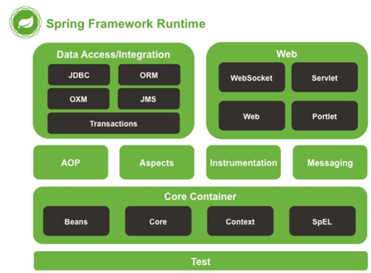

[toc]

# Spring概述

- Spring 是于 2003 年兴起的一个轻量级的 Java 开发框架，它是为了解决企业应用开发的复杂性而创建的。**Spring的核心是控制反转（IoC）和面向切面编程（AOP）。**Spring 是可以在 Java SE/EE 中使用的轻量级开源框架。
- Spring的优点（特点）
  1. **轻量级：**由20多个模块构成，每个模块的jar包小于1m，核心包仅仅只有3m左右。同时，Spring 框架运行占用的资源少，运行效率高。不依赖其他 jar。
  2. **面向接口编程：**使用接口，就是面向靓货，项目的可扩展性，可维护性都极高，接口不关心实现类的类型，同时接口指向实现类，切换实现类即可切换整个功能
  3. **AOP（面向切面编程）：**就是将公共的，通用的，重复的代码单独开发,在需要的时候反织回去。底层的原理是动态代理。
  4. **整合其他框架：**Spring 不排斥各种优秀的开源框架，相反 Spring 可以降低各种框架的使用难度，Spring 提供了对各种优秀框架（如 Struts2,Hibernate、MyBatis）等的直接支持。简化框架的使用。Spring 像插线板一样，其他框架是插头，可以容易的组合到一起。需要使用哪个框架，就把这个插头放入插线板。不需要可以轻易的移除。

## Spring的结构体系

- Spring 由 20 多个模块组成，它们可以分为数据访问/集成（DataAccess/Integration）、Web、面向切面编程（AOP, Aspects）、提供JVM 的代理（Instrumentation）、消息发送（Messaging）、核心容器（Core Container）和测试（Test）
- 


# IOC

## 什么是IOC

- 控制反转IoC(Inversion of Control）  是一个概念，是一种思想。指将传统上由程序代码直接操控的对象调用权交给容器，通过容器来实现对象的装配和管理。控制反转就是对对象控制权的转移，从程序代码本身反转到了外部容器。通过容器实现对象的创建，属性赋值， 依赖的管理。

- 正转:由程序员进行对象的创建和依赖注入称为正转.程序员说了算.

  ```java
   Student stu = new Student();   ===>程序员创建对象
   stu.setName("张三");           ===>程序员进行赋值
   stu.setAge(22);
  ```

  反转:由Spring容器创建对象和依赖注入称为反转,将控制权从程序员手中夺走,由给Spring容器,称为反转. 容器说了算.

  ```xml
  <bean id="stu" class="com.bjpowernode.pojo.Student">     ===>Spring容器负责对象的创建
      <property name="name" value="张三">                    ===>Spring容器依赖注入值
      <property name="age" value="22"> 
    </bean>
  ```

  切记:Spring容器在启动时,就创建所有的对象stu....


## 基于xml的DI

- DI其实就是IOC，IOC是一种思想，一种概念，DI则是实现这个思想和概念

- 具体步骤

  1. 在pom文件中添加依赖，配置好资源资源插件

     ```xml
     <dependency>
           <groupId>org.springframework</groupId>
           <artifactId>spring-context</artifactId>
           <version>5.2.5.RELEASE</version>
      </dependency>
     ```

     ```xml
     <build>
         <resources>
           <resource>
             <directory>src/main/java</directory>
             <includes>
               <include>**/*.xml</include>
               <include>**/*.properties</include>
             </includes>
           </resource>
           <resource>
             <directory>src/main/resources</directory>
             <includes>
               <include>**/*.xml</include>
               <include>**/*.properties</include>
             </includes>
           </resource>
         </resources>
       </build>
     ```

  2. 创建实体类

  3. 创建Spring的配置文件applicationContext.xml，并且使用bean标签实例一个对应的bean元素

     ```xml
     <beans xmlns="http://www.springframework.org/schema/beans"
            xmlns:xsi="http://www.w3.org/2001/XMLSchema-instance"
            xsi:schemaLocation="http://www.springframework.org/schema/beans http://www.springframework.org/schema/beans/spring-beans.xsd">
     
         <!-- 创建学生对象
             等同于 Student stu = new Student();
             id：就是创建的对象的名称
             class：就是创建的对象的类型，底层通过反射构建对象
         -->
         <bean id="stu" class="xyz.current.bean.Student">
             <property name="name" value="张三"></property>
             <property name="age" value="22"></property>
             <!-- 这个标签是为变量赋值 -->
         </bean>
     </beans>
     ```

     ```xml
     <!-- 要是需要添加的是引用数据类型，用这种方式添加就必须是在本文件中实例过 -->
      <!-- 创建学校对象
         -->
         <bean id="sc" class="xyz.current.bean02.School" >
             <property name="name" value="无厘头"></property>
             <property name="address" value="翻斗花园二号"></property>
         </bean>
         <!-- 创建学生对象 -->
         <bean id="stu" class="xyz.current.bean02.Student">
             <property name="name" value="李四"></property>
             <property name="age" value="18"></property>
             <property name="school" ref="sc"></property>
         </bean>
     ```

     使用构造方法注入的几种用法，介绍：

     ```xml
      a.使用构造方法的参数名称进行注入值
                 <bean id="school" class="com.bjpowernode.pojo3.School">
     		        <constructor-arg name="name1" value="清华大学"></constructor-arg>
     		        <constructor-arg name="address1" value="海淀区"></constructor-arg>
     	    	</bean>
     b.使用构造方法参数的下标注入值
      			<bean id="stu" class="com.bjpowernode.pojo3.Student">
     		        <constructor-arg index="0" value="钱七"></constructor-arg>
      		        <constructor-arg index="1" value="22"></constructor-arg>
     		        <constructor-arg index="2" ref="school"></constructor-arg>
     		    </bean>
     c.使用默认的构造方法的参数的顺序注入值
            		<bean id="stuSequence" class="com.bjpowernode.pojo3.Student">
     		        <constructor-arg value="陈十"></constructor-arg>
     		        <constructor-arg value="22"></constructor-arg>
     		        <constructor-arg ref="school"></constructor-arg>
     		    </bean>
     ```

     

  4. 测试类测试

     ```java
     @Test
         public void testSpringStudent(){
             //由Spring容器进行对象的创建
             ApplicationContext ac = new ClassPathXmlApplicationContext("s01/applicationContext.xml");
             Student stu = (Student) ac.getBean("stu");
             System.out.println(stu);
         }
     ```

     

## 项目的三层架构

- 使用三层架构进行用户的插入操作.
- 界面层,业务逻辑层,数据访问层(模拟).
- Spring会接管三层架构中哪些对象的创建?界面层的对象,业务逻辑层的对象,数据访问层的对象.
- 非Spring接管下的三层项目构建:
  - 实体类	
    - com.bjpowernode.pojo  
      - Users
  - 数据访问层      
    - com.bjpowernode.dao   
      - UsersMapper.java(接口)
      - UsersMapperImpl.java(实现类)
  - 业务逻辑层       
    - com.bjpowernode.service   
      - UsersService.java(接口)
      - UsersServiceImpl.java(实现类 )
  - 界面层             
    - om.bjpowernode.controller  
      - UsersController.java


## 基于注解的DI

- 也称为DI(Dependency Injection),它是IOC的具体实现的技术。

- 基于注解的IOC，必须要在Spring的核心配置文件中添加包扫描。

  ```xml
  <context:component-scan base-package="com.bjpowernode.s01"></context:component-scan>
  
  <!-- =============================包扫描的方式。在这里讲一下========================== -->
  1)单个包扫描(推荐使用)
      <context:component-scan base-package="com.bjpowernode.controller"></context:component-scan>
      <context:component-scan base-package="com.bjpowernode.service.impl"></context:component-scan>
      <context:component-scan base-package="com.bjpowernode.dao"></context:component-scan>
  2)多个包扫描,多个包之间以逗号或空格或分号分隔
      <context:component-scan base-package="com.bjpowernode.controller com.bjpowernode.service ,com.bjpowernode.dao"></context:component-scan>
  3)扫描根包(不推荐)
      <context:component-scan base-package="com.bjpowernode"></context:component-scan>
      会降低容器启动的速度,导致多做无用功.
  ```

- 各类注解：

  1. 创建对象的注解：

     - @Component:可以创建任意对象.创建的对象的默认名称是类名的驼峰命名法.也可以指定对象的名称@Component("指定名称")。
     - @Controller:专门用来创建控制器的对象(Servlet),这种对象可以接收用户的请求,可以返回处理结果给客户端。
     - @Service:专门用来创建业务逻辑层的对象,负责向下访问数据访问层,处理完毕后的结果返回给界面层。
     - @Repository:专门用来创建数据访问层的对象,负责数据库中的增删改查所有操作。

     ```java
     案例:
     	@Component("stu")  //交给Spring去创建对象,就是在容器启动时创建
     	public class Student {
     	    @Value("张三")  ===>简单类型的值注入
     	    private String name;
     	    @Value("22")
     	    private int age;
             ...}
     ```

  2. 依赖注入的注解

     - @Value:用来给简单类型注入值

     - 引用类型的注入

       - @Autowired:使用类型注入值，从整个Bean工厂中搜索同源类型的对象进行注入。同源类型也可注入。

         ```
         同源类型：
         	 a.被注入的类型(Student中的school)与注入的类型是完全相同的类型
              b.被注入的类型(Student中的school父)与注入的类型(子)是父子类
              c.被注入的类型(Student中的school接口)与注入的类型(实现类)是接口和实现类的类型
         
             注意:在有父子类的情况下,使用按类型注入,就意味着有多个可注入的对象.此时按照名称进行二次筛选,选中与被注入对象		相同名称的对象进行注入.
         ```

         - @Autowired  @Qualifier("名称"):使用名称注入值,从整个Bean工厂中搜索相同名称的对象进行注入.

         注意:如果有父子类的情况下,直接按名称进行注入值.

       - @Resource，优先名称注入，名称一样比对类型

         - 如果同时指定了name和type，则从Spring上下文中找到唯一匹配的bean进行装配，找不到则抛出异常
         - 如果只指定了name，则从上下文中查找名称（id）匹配的bean进行装配，找不到则抛出异常
         - 如果只指定了type，则从上下文中找到类型匹配的唯一bean进行装配，找不到或者找到多个，都会抛出异常
         - 如果既没有指定name，又没有指定type，**则自动按照byName（字段名字作为bean id）方式进行装配；如果没有匹配，则类型进行匹配**

     - 案例：

       ```java
       @Component("stu")//交给Spring去创建对象，就是在容器启动的时候创建,同时创建的对象的默认名称是类名的驼峰命名法
       public class Student {
           @Value("李四")
           private String name;
           @Value("22")
           private int age;
       
           //引用类型按类型注入（该标签单个使用的时候）
           @Autowired
           //按名称注入（必须要和上面的标签联合使用，才是按名称注入）
           @Qualifier("school")
           private School school;
       
           public Student(){
               System.out.println("学生对象的无参构造方法执行了！！！！！！！！！！");
           }
       
           @Override
           public String toString() {
               return "Student{" +
                       "name='" + name + '\'' +
                       ", age=" + age +
                       ", school=" + school +
                       '}';
           }
       ```


## 注解与XML的对比

- 注解：
  - 优点
    - 方便，直观，高效（代码量少，没有配置文件的书写繁杂）
  - 缺点：
    - 以硬编码的范式写入到Java代码中，修改是需要重新编译代码的。
- XML
  - 有点
    - 配置和代码分离。在xml中修改，无序编译代码，只需要重启服务器即可将新的配置加载
  - 缺点
    - 编写麻烦，效率低，如果是大型项目则过于复杂


## 指定多个Spring配置文件

- 在实际应用里，随着引用规模的增加，系统中Bean的数量也大量增加，导致配置文件变得非常庞大，臃肿。为了避免这种情况发生，提高配置文件的可读性和可维护行，可以将Spring配置文件分解成多个配置文件

- 拆分并整合

  ```xml
  1)单个文件导入 
      <import resource="applicatoinContext_mapper.xml"></import>
      <import resource="applicatoinContext_service.xml"></import>
      <import resource="applicatoinContext_controller.xml"></import>
  2)批量导入
      <import resource="applicatoinContext_*.xml"></import>
  ```

  

# AOP

## AOP概述

- AOP（Aspect Orient Programming），面向切面编程。面向切面编程是从动态角度考虑程序运行过程。AOP 底层，就是采用动态代理模式实现的。采用了两种代理：JDK 的动态代理，与 CGLIB的动态代理。
- AOP 为 Aspect Oriented Programming 的缩写，意为：面向切面编程，可通过运行期动态代理实现程序功能的统一维护的一种技术。AOP 是 Spring 框架中的一个重要内容。利用 AOP 可以对业务逻辑的各个部分进行隔离，从而使得业务逻辑各部分之间的耦合度降低，提高程序的可重用性，同时提高了开发的效率。
- 切面：公共的，通用的，重复的功能称为切面，面向切面编程就是将切面提取出来，单独开发，在需要调用的方法中通过动态代理的方式进行织入。

### AOP的好处

1. 减少重复
2. 专注业务

注意：面向切面编程只是面向对象编程的一种补充。用 AOP 减少重复代码，专注业务实现。


## 手动模拟AOP框架

主要目的是进行业务逻辑与切面的解耦合。完全分离业务逻辑和切面。

1. 第一个版本：业务和切面紧耦合在一起,没有拆分。
2. 第二个版本：使用子类代理的方式拆分业务和切面。
3. 第三个版本：使用静态代理拆分业务和切面.业务和业务接口已拆分。此时切面紧耦合在业务中。
4. 第四个版本：使用静态代理拆分业务和业务接口,切面和切面接口。
5. 第五个版本：使用动态代理完成第四个版本的优化。

第五个版本逻辑展示

```java
//动态代理工厂类
public class ProxyFactory {
    //通过方法参数传入目标对象和切面对象
    public static Object getAgent(Service target,AOP aop){
        return Proxy.newProxyInstance(target.getClass().getClassLoader(),
                target.getClass().getInterfaces(),
                new InvocationHandler() {
                    @Override
                    public Object invoke(Object proxy, Method method, Object[] args) throws Throwable {
                        Object obj=null;
                        try {
                            aop.before();  //灵活的进行切面功能切换
                             obj = method.invoke(target,args);  //灵活的进行业务功能切换
                            aop.after();  //灵活的进行切面功能切换
                        } catch (Exception e) {
                            aop.exception();  //灵活的进行切面功能切换
                        }
                        return obj;//目标方法的返回值
                    }
                }); //返回动态代理对象
    }
}
```

```java
//测试类
public class MyTest05 {
    @Test
    public void test03(){
       //得到代理对象
        Service agent = (Service) ProxyFactory.getAgent(new ProductServiceImpl(),new TransAop());
        Service agent1 = (Service) ProxyFactory.getAgent(agent,new LogAop());
        agent1.buy();
    }
}
```

这个解决方案很好的解决了业务和切面的紧耦合。可以灵活的进行业务的切换，可以灵活的进行切面的切换。可以嵌套切面的处理。


## Spring的AOP

- Spring是支持AOP编程的，常用的有以下几种

  1. Before通知：在目标方法被调用前调用，涉及接口：org.springframework.aop.MethodBeforeAdvice;
  2. After通知：在目标方法被调用后调用，涉及接口为：org.springframework.aop.AfterReturningAdvice; 
  3. Throws通知：目标方法跑出异常的时候调用，涉及接口：org.springframework.aop.ThrowsAdvice; 
  4. Around通知：拦截对目标对象方法调用，涉及接口：org.aopalliance.intercept.MethodInterceptor。

- 案例

  ```java
  LogAdvice.java
  public class LogAdvice implements MethodBeforeAdvice {
  	private static SimpleDateFormat sf=new SimpleDateFormat("yyyy年MM月dd日");
  	@Override
  	public void before(Method m, Object[] args, Object arg2)
  			throws Throwable {
  		System.out.println("\n[系统日志]["+sf.format(new Date())+"]"+m.getName()+"("+Arrays.toString(args)+")");
  	}
  }
  
  ```

  ```java
  BookService .java
  public interface BookService {
  
  	public boolean buy(String userName,String bookName,double price);
  	public void comment(String userName,String comments);
  }
  
  ```

  ```java
  public class BookServiceImpl implements BookService {
  	/**
  	 * 购买图书
  	 */
  	@Override
  	public boolean buy(String userName, String bookName, double price) {
  		System.out.println("业务buy开始执行");
  		System.out.println(userName+"购买了图书"+bookName);
  		System.out.println(userName+"增加积分"+(int)(price/10));
  		System.out.println("图书购买完毕，向物流下单....");		
  		System.out.println("业务buy结束");
  		return true;
  	}
  	/**
  	 * 发表评论
  	 */
  	@Override
  	public void comment(String userName, String comments) {
  		System.out.println("业务comment开始执行");
  		System.out.println(userName+"发表图书评论"+comments);
  		System.out.println("业务comment执行结束");		
  	}
  }
  
  ```

  ```xml
  applicationContext.xml
  <!-- 实现业务功能的实现类 -->
  <bean id="bookServiceTarget" class="com.oracle.aop.biz.impl.BookServiceImpl"></bean>
  <!-- 日志功能 -->
  <bean id="logAdvice" class="com.oracle.aop.LogAdvice"></bean>
  <bean id="bookService" class="org.springframework.aop.framework.ProxyFactoryBean">
  	<!-- 将要绑定的业务接口 -->
  	<property name="proxyInterfaces">
  		<value>com.oracle.aop.biz.BookService</value>
  	</property>
  	<!-- 实现日志功能的切面 -->
  	<property name="interceptorNames">
  		<list>
  			<value>logAdvice</value>
  		</list>
  	</property>
  	<!-- 织入 -->
  	<property name="target" ref="bookServiceTarget"></property>
  </bean>
  
  ```

  ```java
  TestAOP.java
  public class TestAOP {
  	@Test
  	public void testAop(){
  		ApplicationContext context=new ClassPathXmlApplicationContext("applicationContext.xml");
  		BookService bookservice=(BookService)context.getBean("bookService");
  		bookservice.buy("高志水", "CMMi实务手册", 50);
  		bookservice.comment("王筝","《盗墓笔记》一点都不恐怖，很好看！");		
  	}
  }
  
  ```


## AspectJ框架

- 该框架是eclipse的开源项目，是一个优秀的面向切面的框架，他基于Java开发，扩展了Java语言，提供了强大的切面实现，易学易用

- 添加AspectJ依赖

  ```xml
  <dependency>
  	<groupId>junit</groupId>
  	<artifactId>junit</artifactId>
  	<version>4.11</version>
  	<scope>test</scope>
  </dependency>
  <dependency>
  	<groupId>org.springframework</groupId>
  	<artifactId>spring-context</artifactId>
  	<version>5.2.5.RELEASE</version>
  </dependency>
  <dependency>
  	<groupId>org.springframework</groupId>
  	<artifactId>spring-aspects</artifactId>
  	<version>5.2.5.RELEASE</version>
  </dependency>
  
  ```

  

### 常用术语

1. 切面（Aspect）：面泛指交叉业务逻辑,或是公共的，通用的业务。上例中的事务处理、日志处理就可以理解为切面。常用的切面是通知（Advice）。实际就是对主业务逻辑的一种增强。
2. 连接点（JoinPoint）：连接点指可以被切面织入的具体方法。通常业务接口中的方法均为连接点。
3. **切入点（Pointcut）：**切入点指声明的一个或多个连接点的集合。通过切入点指定一组方法。被标记为 final 的方法是不能作为连接点与切入点的。因为最终的是不能被修改的，不能被增强的。
4. 目标对象（Target）：目标对象指将要被增强 的对象。 即包含主业 务逻辑的 类的对象。 上例中 的BookServiceImpl 的对象若被增强，则该类称为目标类，该类对象称为目标对象。当然， 不被增强，也就无所谓目标不目标了。
5. **通知（Advice）：**来指定切入的时机。是在目标方法执行前还是执行后还是出错时,还是环绕目标方法切入切面功能**。**
6. **总结：切入点决定切入的位置，通知决定切入的时机**


### 切入点表达式

- 原型：**execution(访问权限 方法返回值 方法声明(参数) 异常类 型)**   【其中访问权限和异常类型可省略】

- 例子：

  | 例子                                  | 意思                                                         |
  | ------------------------------------- | ------------------------------------------------------------ |
  | execution(public * *(..))             | 指定切入点为：任意公共方法。                                 |
  | execution(* set*(..))                 | 指定切入点为：任何一个以“set”开始的方法。                    |
  | execution(* com.xyz .service.*.*(..)) | 指定切入点为：定义在 service 包里的任意类的任意方法。        |
  | execution(* com.xyz.service..*.*(..)) | 指定切入点为：定义在 service 包或者子包里的任意类的任意方法。“..”出现在类名中时，后面必须跟“*”，表示包、子包下的所有类 |
  | execution(* *..service.*.*(..))       | 指定所有包下的 serivce 子包下所有类（接口）中所有方法为切入点 |
  | execution(* *.service.*.*(..))        | 指定只有一级包下的 serivce 子包下所有类（接口）中所有方法为切入点 |


### AspectJ的通知

- #### @Before

  - 用来指定切入的时机，使用此注解表示在业务方法（目标方法）执行前，切入切面功能，是一个前置通知

  - 规范

    1. 方法的访问权限是public
    2. 方法没有返回值
    3. 方法名称自定义
    4. 方法没有参数，如果有参，也是固定的参数JoinPoint（目标方法）
       - JoinPoint：如果出现此参数，它必须是第一个位置的参数，其它通知都有这个参数

  - 例子

    ```java
    @Before(value="execution(public String xyz.current.s01.SomeServiceImpl.doSome(String,int))")
        public void myBefore(JoinPoint joinPoint){
            System.out.println("切面方法的实现");
            System.out.println("目标方法的签名："+joinPoint.getSignature());
            System.out.println("目标方法的参数："+ Arrays.toString(joinPoint.getArgs()));
        }
    ```

- #### @AfterReturning

  - 此通知为后置通知，在目标方法执行后切入切面的功能，也就是增强功能。 

  - 后置通知得到的目标方法的返回值是通知参数传入的。

  - 规范：

    1. 访问权限是public
    2. 方法有参数，其参数是目标方法的返回值
    3. 方法名称自定义
    4. 没有返回值

  - 例子

    ```java
    @AfterReturning(value = "execution(* xyz.current.s02.*.*(..))",returning = "obj")
        public void myAfterReturning(Object obj){
            //方法的参数传值：值传递和引用传递
    		//值传递实参的内容不改变，引用传递可改变
    		//当前的Object res:是引用传递，如果是非String类型，则可改变 ，是String类型，不可变。
    		//可不可以对返回值做更改？
    		//因为我是后置通知，所以目标方法执行结束后再执行切面功能，所以可以得到目标方法的返回值，也可以更改返回值
            System.out.println("后置通知功能实现");
            if (obj != null){
                if (obj instanceof String){
                    obj = obj.toString().toUpperCase(Locale.ROOT);
                    System.out.println("在切面方法中目标的返回值："+ obj);
                }
            }
        }
    ```

- #### @Around

  - 环绕通知-增强方法有 ProceedingJoinPoint参数

  - 在目标方法执行前后都可以增强功能（事务），它可以直接改变目标方法的返回值。因为在切面方法中直接得到目标方法的返回值

  - 规范：

    1. 访问权限是public
    2. 方法有返回值，次返回值就是目标方法的返回值
    3. 方法有参数，是ProceedingJoinPoint，这个参数就是目标方法，是JoinPoint的子类
    4. 方法名称自定义
    5. 声明异常Throwable

  - 例子1，增强访问：

    ```java
    @Around(value = "execution(* com.bjpowernode.s03.SomeServiceImpl.*(..))")
    public Object myAspect(ProceedingJoinPoint pjp) throws Throwable {
    //前增强
    System.out.println("我是前置功能增强......................");
    //目标方法的调用
    String res = (String) pjp.proceed(); //method.invoke()手工调用方法 ，调用了
    doThree()方法
    //后增强
    System.out.println("我是后置功能增强......................");
    return res+"hahaha";
    ```

  - 例子2，限制访问：

    ```java
    //取得参数，进行判断name是否是张三，如果是，则进行功能增强，如果不是则什么都不
    做
    String res = "";
    Object []objs = pjp.getArgs();
    if(objs != null && objs.length >1 ){
    	String name = (String) objs[0];
        if("张三".equals(name)){
            //可以进行前置功能增强
            System.out.println("我是前置功能增强...............");
            //目标方法调用
            res = (String) pjp.proceed();
            //后置功能增强
            System.out.println("我是后置功能增强..............");
            return res+"----haha";
        }else{
            System.out.println("无法进行功能增强.......");
        }
    }
    return null;
    ```

- #### @After

  - 最终通知，类似finally，无论目标方法是否抛出异常，该增强都会被执行

- #### @Pointcut

  - 给切入点表达式起别名，名称就是方法名

  

# Spring集成MyBatis

- 将 MyBatis 与 Spring 进行整合，主要解决的问题就是将 SqlSessionFactory 对象交由 Spring 来管理。所以，该整合只需要将 SqlSessionFactory 的对象生成器 SqlSessionFactoryBean 注册在 Spring 容器中，再将其注入给 Dao 的实现类即可完成整合。

- 实现 Spring 与 MyBatis 的整合。常用的方式：扫描的 Mapper 动态代理。Spring 像插线板一样，mybatis 框架是插头，可以容易的组合到一起。插线板 spring 插上 mybatis，两个框架就是一个整体。

### Spring事务管理

- 事务原本是数据库中的概念，在实际项目的开发中，进行事务的处理一般是在业务逻辑层， 即 Service 层。这样做是为了能够使用事务的特性来管理关联操作的业务。
- 在 Spring 中通常可以通过以下两种方式来实现对事务的管理：
  1. 使用Spring的事务注解管理事务
  2. 使用AspectJ的AOP配置管理事务（声明式事务）

### Spring中五大隔离级别

在数据库中有四大隔离级别，也就是在Spring中的前四个，但是在Spring事务中多了一个默认隔离级别就是数据库本身默认隔离级别

1. 未提交读(Read Uncommitted)：允许脏读，也就是可能读取到其他会话中未提交事务修改的数据
2. 提已交读(Read Committed)：只能读取到已经提交的数据。Oracle等多数数据库默认都是该级别 (不重复读)
3. 可重复读(Repeated Read)：可重复读。在同一个事务内的查询都是事务开始时刻一致的，InnoDB默认级别。在SQL标准中，该隔离级别消除了不可重复读，但是还存在幻象读，但是innoDB解决了幻读
4. 串行读(Serializable)：完全串行化的读，每次读都需要获得表级共享锁，读写相互都会阻塞

|          隔离级别          |                             含义                             |
| :------------------------: | :----------------------------------------------------------: |
|     Isolation.DEFAULT      |                 使用后端数据库默认的隔离级别                 |
| Isolation.READ_UNCOMMITTED |    允许读取上位提交的更改。可能导致脏读，幻读或不可重复读    |
|  Isolation.READ_COMMITTED  | 允许从已经提交的并发事务读取。可防止脏读，但幻影读和不可重复读仍可能发生 |
| Isolation.REPEATABLE_READ  | 对相同字段的多次读取的结果是一致的，除非数据被当前事务本身改变。可防止脏读和不可重复读，但幻读仍可能发生 |
|   Isolation.SERIALIZABLE   | 完全服从ACID的隔离级别,确保不发生脏读，不可重复读和幻读。这个在所有的隔离级别中效率是最慢的，应为他通常是通过完全锁定当前事务锁所设计的数据来实现。 |

**面试点：**

- mysql：默认的隔离级别是REPEATABLE_READ，也就是可重复读
- Oracle：oracle数据库支持READ COMMITTED 和 SERIALIZABLE这两种事务隔离级别。默认系统事务隔离级别是READ COMMITTED,也就是读已提交


## 事务的传播特性

1. PROPAGATION_REQUIRED：必被包含事务
2. PROPAGATION_REQUIRES_NEW：自己新开事务，不管之前是否有事务 
3. PROPAGATION_SUPPORTS：支持事务，如果加入的方法有事务，则支持事务，如果没有，不单开事务 
4. PROPAGATION_NEVER：不能运行中事务中，如果包在事务中，抛异常 
5. PROPAGATION_NOT_SUPPORTED：不支持事务，运行在非事务的环境不常用 
6. PROPAGATION_MANDATORY：必须包在事务中，没有事务则抛异常 
7. PROPAGATION_NESTED：嵌套事务

|         传播行为          |                             描述                             |
| :-----------------------: | :----------------------------------------------------------: |
|   PROPAGATION_REQUIRED    | 如果没有，就开启一个事务；如果有，就加入当前事务（方法B看到自己已经运行在方法A的事务内部，就不再起行的事务，直接加入方法A的事务） |
| PROPAGATION_REQUIRES_NEW  | 如果没有，就开启一个事务；如果有，就将当前事务挂起，另起一个新事务，当新事务执行完毕后继续回去执行老事务 |
|   PROPAGATION_SUPPORTS    |      如果没有，就以非事务方式执行，如果有就加入当前事务      |
|     PROPAGATION_NEVER     |         如果没有就以非事务方式执行，如果有就跑出异常         |
| PROPAGATION_NOT_SUPPORTED | 如果没有就以非事务方式执行，如果就，就将当前事务挂起（方法A所在的事务就会挂起，而方法B以非事务的状态运行完，在继续方法A的事务） |
|   PROPAGATION_MANDATORY   |        如果没有，就以非事务方式执行；如果有就跑出异常        |
|    PROPAGATION_NESTED     |  如果没有就开启一个事务，如果有，就在当前事务中嵌套其他事务  |


## 事务管理方式

### @Transactional注解方式

#### 代码

```java
@Transactional(propagation = Propagation.REQUIRED,//事务传播特性
        noRollbackForClassName = {"ArithmeticException"},//指定发生什么异常不回滚，使用的是异常的名称
        noRollbackFor = ArithmeticException.class,//指定发生什么异常的时候不会滚，使用的是异常的类型
        timeout = -1,//连接超时设置。默认值是-1.表示用不超时
        readOnly = false,//默认是false，如果是查询操作，必须设置为true
        isolation = Isolation.DEFAULT//使用数据库自己的隔离级别
)
```

applicationContext_service.xml

```xml
<?xml version="1.0" encoding="UTF-8"?>
<beans xmlns="http://www.springframework.org/schema/beans"
       xmlns:xsi="http://www.w3.org/2001/XMLSchema-instance"
       xmlns:context="http://www.springframework.org/schema/context" xmlns:tx="http://www.springframework.org/schema/tx"
       xsi:schemaLocation="http://www.springframework.org/schema/beans http://www.springframework.org/schema/beans/spring-beans.xsd http://www.springframework.org/schema/context https://www.springframework.org/schema/context/spring-context.xsd http://www.springframework.org/schema/tx http://www.springframework.org/schema/tx/spring-tx.xsd">

    <!--导入applicationContext_Mapper文件-->
    <import resource="applicationContext_mapper.xml"></import>
    <!--sm是基于注解的开发，所以添加包扫描-->
    <context:component-scan base-package="xyz.current.service.impl"></context:component-scan>

    <!--事务处理-->
    <!-- 1. 添加事务管理器 -->
    <bean id="transactionManger" class="org.springframework.jdbc.datasource.DataSourceTransactionManager">
        <!-- 因为事务必须关联数据库处理，所以要配置数据源 -->
        <property name="dataSource" ref="dataSource"></property>
    </bean>

    <!-- 2. 为事务添加注解驱动 -->
    <tx:annotation-driven transaction-manager="transactionManger"></tx:annotation-driven>
</beans>
```

#### 注意事项

1. 只能声明在public的method。原因是spring是通过JDK代理或者CGLIB代理的，生成的代理类，只能处理public方法，注解放在类名称上面，这样你配置的这个@Transactional 对这个类中的所有public方法都起作用，@Transactional 在方法名上，只对这个方法有作用，同样必须是public的方法。
2. 不能被类内部方法调用。还是因为代理的原因，类内部自调用，不会经过代理类，所以@Transactional不会生效


### xml配置文件方法

#### 实现步骤

1. 导入依赖

   ```xml
     <dependencies>
       <!--单元测试-->
       <dependency>
         <groupId>junit</groupId>
         <artifactId>junit</artifactId>
         <version>4.12</version>
         <scope>test</scope>
       </dependency>
       <!--aspectj依赖-->
       <dependency>
         <groupId>org.springframework</groupId>
         <artifactId>spring-aspects</artifactId>
         <version>5.2.5.RELEASE</version>
       </dependency>
       <!--spring核心ioc-->
       <dependency>
         <groupId>org.springframework</groupId>
         <artifactId>spring-context</artifactId>
         <version>5.2.5.RELEASE</version>
       </dependency>
       <!--做spring事务用到的-->
       <dependency>
         <groupId>org.springframework</groupId>
         <artifactId>spring-tx</artifactId>
         <version>5.2.5.RELEASE</version>
       </dependency>
       <dependency>
         <groupId>org.springframework</groupId>
         <artifactId>spring-jdbc</artifactId>
         <version>5.2.5.RELEASE</version>
       </dependency>
       <!--mybatis依赖-->
       <dependency>
         <groupId>org.mybatis</groupId>
         <artifactId>mybatis</artifactId>
         <version>3.5.6</version>
       </dependency>
       <!--mybatis和spring集成的依赖-->
       <dependency>
         <groupId>org.mybatis</groupId>
         <artifactId>mybatis-spring</artifactId>
         <version>1.3.1</version>
       </dependency>
       <!--mysql驱动-->
       <dependency>
         <groupId>mysql</groupId>
         <artifactId>mysql-connector-java</artifactId>
         <version>8.0.25</version>
       </dependency>
       <!--阿里公司的数据库连接池-->
       <dependency>
         <groupId>com.alibaba</groupId>
         <artifactId>druid</artifactId>
         <version>1.1.12</version>
       </dependency>
     </dependencies>
   ```

   2. 修改事务管理

   ```xml
   <?xml version="1.0" encoding="UTF-8"?>
   <beans xmlns="http://www.springframework.org/schema/beans"
          xmlns:xsi="http://www.w3.org/2001/XMLSchema-instance"
          xmlns:context="http://www.springframework.org/schema/context" xmlns:tx="http://www.springframework.org/schema/tx"
          xmlns:aop="http://www.springframework.org/schema/aop"
          xsi:schemaLocation="http://www.springframework.org/schema/beans http://www.springframework.org/schema/beans/spring-beans.xsd http://www.springframework.org/schema/context https://www.springframework.org/schema/context/spring-context.xsd http://www.springframework.org/schema/tx http://www.springframework.org/schema/tx/spring-tx.xsd http://www.springframework.org/schema/aop https://www.springframework.org/schema/aop/spring-aop.xsd">
   
       <!-- 此配置文件与applicationContext——service.xml的功能一样，只是事务配置不同 -->
       <!-- 导入applicationContext_mapper.xml -->
       <import resource="applicationContext_mapper.xml"></import>
       <!-- 添加包扫描 -->
       <context:component-scan base-package="xyz.current.service"></context:component-scan>
       <!-- 添加事务管理器 -->
       <bean id="DataSourceTransactionManager" class="org.springframework.jdbc.datasource.DataSourceTransactionManager">
           <property name="dataSource" ref="dataSource"></property>
       </bean>
   
       <!-- 配置事务切面 -->
       <tx:advice id="myadvice" transaction-manager="DataSourceTransactionManager">
           <tx:attributes>
               <tx:method name="*select*" read-only="true"/>
               <tx:method name="*find*" read-only="true"/>
               <tx:method name="*search*" read-only="true"/>
               <tx:method name="*get*" read-only="true"/>
               <tx:method name="*insert*" propagation="REQUIRED"/>
               <tx:method name="*add*" propagation="REQUIRED"/>
               <tx:method name="*save*" propagation="REQUIRED"/>
               <tx:method name="*set*" propagation="REQUIRED"/>
               <tx:method name="*update*" propagation="REQUIRED"/>
               <tx:method name="*change*" propagation="REQUIRED"/>
               <tx:method name="*modify*" propagation="REQUIRED"/>
               <tx:method name="*delete*" propagation="REQUIRED"/>
               <tx:method name="*remove*" propagation="REQUIRED"/>
               <tx:method name="*drop*" propagation="REQUIRED"/>
               <tx:method name="*clear*" propagation="REQUIRED"/>
               <tx:method name="*" propagation="SUPPORTS"/>
           </tx:attributes>
       </tx:advice>
   
       <!-- 绑定切面和切入点 -->
       <aop:config>
           <aop:pointcut id="mycut" expression="execution(* xyz.current.service.impl.*.*(..))"/>
           <aop:advisor advice-ref="myadvice" pointcut-ref="mycut"></aop:advisor>
       </aop:config>
   </beans>
   ```

   