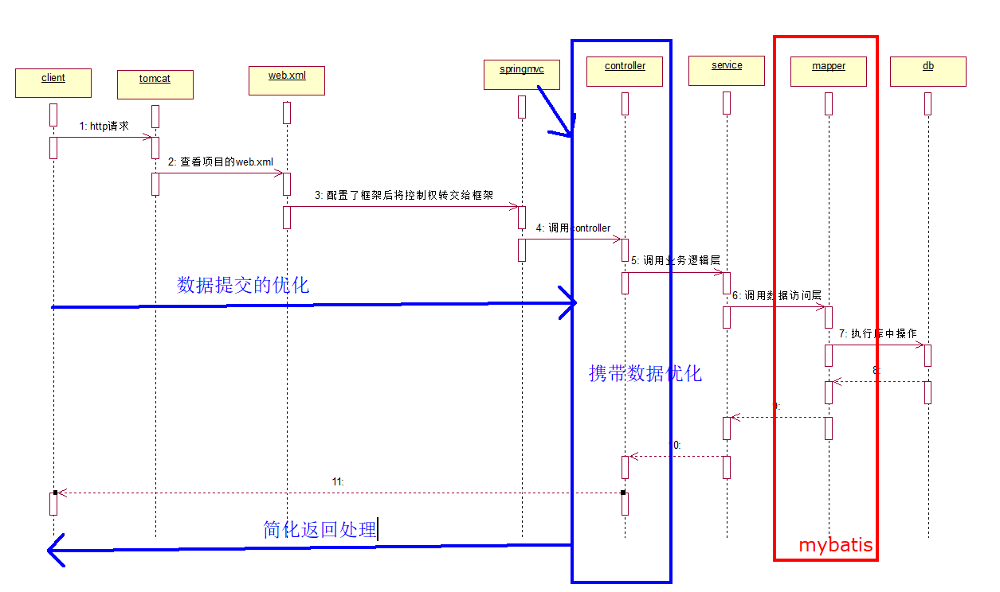
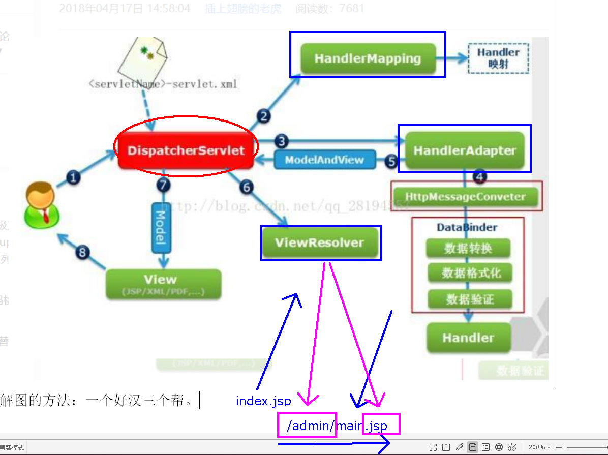
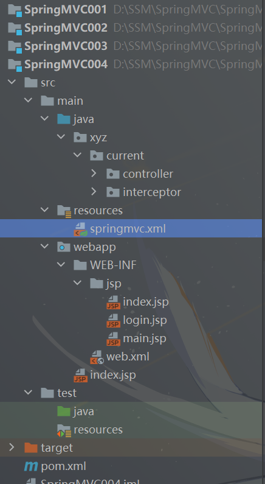

[toc]

# SpringMVC概述

## SpringMVC简介

- SpringMVC 也叫Spring web mvc。是Spring 框架的一部分，是在Spring3.0 后发布的。
- 他是基于MVC开发模式的框架，用来优化控制器，是Spring家族的一员，具备IOC和AOP

### 什么是MVC

- 他是一种开发模式，他是模型视图控制器的简称，所有的WEB应用都是基于MVC开发。
- M：模型层，包含实体类，业务逻辑层，数据访问层
- V：视图层，前端等都是视图层，用来呈现数据
- C：控制器，他是用来接收客户端的请求，并返回响应到客户端的组件，Servlet就是组件。


## SpringMVC的优点

- 基于MVC架构，功能分工明确。解耦合

- 容易理解上手快，使用简单

  - 就可以开发一个注解的 SpringMVC 项目，SpringMVC 也是轻量级的，jar 很小。不依赖的特定的接口和类。

- 作为Spring框架一部分，能够使用Spring的IOC和AOP

  - 方便整合Strtus,MyBatis,Hiberate,JPA 等其他框架。

- SpringMVC强化注解的使用

  - 在Controller, Service, Dao 都可以使用注解。方便灵活。使用@Controller 创建处理器对象,@Service 创建业务对象，@Autowired 或者@Resource 在控制器类中注入 Service,在Service 类中注入 Dao。

  

## SpringMVC的优化方向




## SpringＭVC的执行流程




## 基于注解开发的SpringMVC

- 所谓 SpringMVC 的注解式开发是指，在代码中通过对类与方法的注解，便可完成处理器在 springmvc 容器的注册。注解式开发是重点。

### 创建步骤

1. 新建项目，选择webapp模板
2. 修改目录，添加缺失的test，Java，resources（两套），并修改目录属性
3. 修改pom.xml，添加SpringMVC的依赖，添加Servlet的依赖
4. 添加springmvc.xml配置文件，指定包扫描，添加视图解析器
5. 删除web.xml文件，新建web.xml
6. 在web.xml文件中注册SpringMVC框架（所有的web请求都是基于servlet）
7. 在webapp目录下新建admin目录，在admin目录下新建main.jsp页面，删除index.jsp页面，并新建，发送请求给服务器
8. 开发控制器（Servlet），他是一个普通的类
9. 添加tomcat进行测试功能

## 资源在WEB-INF目录下

- 很多企业会将动态资源放在WEB-INF目录下，这样可以保证资源的安全性。在WEB-INF目录下的动态资源不可以直接访问，必须要通过请求转发的方式进行访问。这样避免了通过地址栏直接对资源的访问。重定向也无法访问动态资源。

- 

- action

  ```java
  @Controller
  public class WebInfAction {
  
      @RequestMapping("/showIndex")
      public String showIndex(){
          System.out.println("访问index.jsp");
          return "index";
      }
  
      @RequestMapping("/showMain")
      public String showMain(){
          System.out.println("访问main.jsp");
          return "main";
      }
  
      @RequestMapping("/showLogin")
      public String showLogin(){
          System.out.println("访问Login.jsp");
          return "login";
      }
  
      //登录的业务判断
      @RequestMapping("/login")
      public String login(String name, String pwd, HttpServletRequest request){
          if ("cur".equals(name) && "123456".equals(pwd)){
              //在session中存储用户信息，用于进行权限验证
              request.getSession().setAttribute("users",name);
              return "main";
          }else {
              request.setAttribute("msg","用户名或密码不正确");
              return "login";
          }
      }
  }
  ```

# SpringMVC拦截器

- 针对请求和响应进行的额外的处理，在请求和响应的过程中添加预处理，后处理和最终处理。
- SpringMVC 中的 Interceptor 拦截器，它的主要作用是拦截指定的用户请求，并进行相应的预处理与后处理。其拦截的时间点在“处理器映射器根据用户提交的请求映射出了所要执行的处理器类，并且也找到了要执行该处理器类的处理器适配器，在处理器适配器执行处理器之前”。当然，在处理器映射器映射出所要执行的处理器类时，已经将拦截器与处理器组合为了一个处理器执行链，并返回给了中央调度器。

@Controller
public class WebInfAction {

```java
@RequestMapping("/showIndex")
public String showIndex(){
    System.out.println("访问index.jsp");
    return "index";
}

@RequestMapping("/showMain")
public String showMain(){
    System.out.println("访问main.jsp");
    return "main";
}

@RequestMapping("/showLogin")
public String showLogin(){
    System.out.println("访问Login.jsp");
    return "login";
}

//登录的业务判断
@RequestMapping("/login")
public String login(String name, String pwd, HttpServletRequest request){
    if ("cur".equals(name) && "123456".equals(pwd)){
        //在session中存储用户信息，用于进行权限验证
        request.getSession().setAttribute("users",name);
        return "main";
    }else {
        request.setAttribute("msg","用户名或密码不正确");
        return "login";
    }
}
```
}

### 拦截器的实现

拦截器的实现有两种方案

1. 继承HandlerInterceptorAdapter的父类
2. 实现HandlerInterceptor接口【有接口用接口，极力推荐，Java是单继承的，所以要留下宝贵的继承位】

### 拦截器的执行时机

1. preHandle():在请求被处理之前进行操作
2. postHandle():在请求被处理之后,但结果还没有渲染前进行操作,可以改变响应结果
3. afterCompletion():所有的请求响应结束后执行善后工作,清理对象,关闭资源


### 自定义拦截器实现权限验证

1. 改造登录方法,在session中存储用户信息,用于进行权限验证

   ```java
   //登录的业务判断
       @RequestMapping("/login")
       public String login(String name, String pwd, HttpServletRequest request){
           if ("cur".equals(name) && "123456".equals(pwd)){
               //在session中存储用户信息，用于进行权限验证
               request.getSession().setAttribute("users",name);
               return "main";
           }else {
               request.setAttribute("msg","用户名或密码不正确");
               return "login";
           }
       }
   ```

2. 开发拦截器的功能.实现HandlerInterceptor接口,重写preHandle()方法

   ```java
   @Override
       public boolean preHandle(HttpServletRequest request, HttpServletResponse response, Object handler) throws Exception {
           //是否登录过的判断
           if (request.getSession().getAttribute("users") == null){
               //此时就是没有登录，打回到登录页面，并给出提示
               request.setAttribute("msg","您还没有登录，请先登录");
               request.getRequestDispatcher("/WEB-INF/jsp/login.jsp").forward(request,response);
               return false;
           }
           return true;//放行请求
       }
   ```

3. 在springmvc.xml文件中注册拦截器

   ```xml
   <!-- 注册拦截器 -->
       <mvc:interceptors>
           <mvc:interceptor>
               <!--映射要拦截的请求-->
               <mvc:mapping path="/**"/>
               <!-- 设置放行的请求 -->
               <mvc:exclude-mapping path="/showLogin"/>
               <mvc:exclude-mapping path="/login"/>
               <!--配置具体的拦截器实现功能的类-->
               <bean class="xyz.current.interceptor.LoginInterceptor"></bean>
           </mvc:interceptor>
       </mvc:interceptors>
   ```


# SpringMVC日期

## 日期注入

-   日期类型不能自动注入到方法的参数中。需要单独做转换处理。使用@DateTimeFormat注解，需要在springmvc.xml文件中添加`<mvc:annotation-driven/>`标签。

### 在方法的参数上使用@DateTimeForma

```java
@RequestMapping("/submitone")  
public String submitdateone(  
@DateTimeFormat(pattern="yyyy-MM-dd")  
        Date mydate){  
    System.out.println(mydate);  
    return "dateShow";  
}
```

### 在类的成员setXXX()方法上使用@DateTimeForma

```java
@DateTimeFormat(pattern="yyyy-MM-dd")  
public void setDate(Date date) {  
this.date = date;  
}
```


### @InitBinder注解解决类中日期问题

```java
@InitBinder  
public void initBinder(WebDataBinder dataBinder) {  
    SimpleDateFormat sf = new SimpleDateFormat("yyyy-MM-dd");  
dataBinder.registerCustomEditor(Date.class, new CustomDateEditor(sf, true));  
}
```

这样在类中出现的所有日期都可以进行转换了

## 日期显示

### JSON中的日期显示

- 需要在类中的成员变量的getXXX方法上加注解

  ```java
  @JsonFormat(pattern="yyyy-MM-dd HH:mm:ss")  
  public Date getDate() {  
  return date;  
  }
  ```

  

### JSP页面的日期显示

- 这里需要使用jstl依赖，国际化标签

  ```xml
  <dependency>  
      <groupId>jstl</groupId>  
      <artifactId>jstl</artifactId>  
      <version>1.2</version>  
  </dependency>
  ```

  

- 在页面的导入标签库，如果是单个日期对象，直接转为好看的格式化的字符串进行显示。如果是list中的实体类对象的成员变量是日期类型，则必须使用jstl进行显示。

  ```xml
  <%--导入jstl核心标签库--%>  
  <%@taglib prefix="c" uri="http://java.sun.com/jsp/jstl/core" %>  
  <%--导入jstl格式化标签库--%>  
  <%@taglib prefix="fmt" uri="http://java.sun.com/jsp/jstl/fmt" %>
  ```

- 使用标签显示数据


# SpringMVC注解式开发

## @RequestMapping

### 指定模块名称

- 通过@RequestMapping注解可以定义处理器对于请求的映射规则。该注解可以注解在方法上，也可以注解在类上，但是意义是不同的。属性value的值通常是以 “ / ” 开始。@RequestMapping的value属性用于定义所匹配的URL

- 一个@Controller 所注解的类中，可以定义多个处理器方法。当然，不同的处理器方法所匹配的 URI 是不同的。这些不同的 URI 被指定在注解于方法之上的@RequestMapping 的value 属性中。

- 但若这些请求具有相同的 URI 部分，则这些相同的 URI部分可以被抽取到注解在类之上的@RequestMapping 的 value 属性中。此时的这个 URI 表示模块（相当于包）的名称。URI 的请求是相对于 Web 的根目录。

- 例子：

  提取前：

  ```java
  @Controller
  public class HelloSpringMVC{
  	//相当于一个控制器的处理方法
  	@RequestMapping("/current/hello");
  	public String one(){
  		return "main";
  	}
  	
  	@RequestMapping("/current/hello2");
  	public String two(){
  		return "main";
  	}
  }
  ```

  提取后：

  ```java
  @Controller
  @RequestMapping("/current")
  public class HelloSpringMVC{
  	//相当于一个控制器的处理方法
  	@RequestMapping("/hello");
  	public String one(){
  		return "main";
  	}
  	
  	@RequestMapping("/hello2");
  	public String two(){
  		return "main";
  	}
  }
  ```


### 请求提交方式的定义

- 总所周知，http请求方式有很多种，最常用的是get和post

- 对于@RequestMapping，有一个Method属性，用于对被注解方法所处理的提交请求进行限制（简单来说就是只有满足method属性所指定的请求方式，才会执行该方法）

  ```java
  @RequestMapping(value = "/hello",method = RequestMethod.POST)、
  //象上面这种就是只能处理post方法
  public String one() {
  	return "main";
  }
  ```

- 当然要是没有指定method属性，那无论是什么提交方式，均可匹配。具体要不要写视情况而定

  

### 五种数据提交的方式

前四种数据注入的方式，会自动进行类型的转换。但是无法自动转换日期类型

#### 1. 单个数据注入

- 在方法中声明一个和表单提交的参数名称相同的参数，由框架按照名称直接注入	

  web：

  ```xml
  <h2>1,单个数据提交</h2>
      <form action="${pageContext.request.contextPath}/one.action" method="post">
          姓名：<input name="myname"><br>
          年龄：<input name="age"><br>
          <input type="submit" value="go3">
  	</form>
  ```

  action：

  ```java
  @RequestMapping("/one")
  public String one(String myname,int age){
      System.out.println("myname="+myname+"age="+(age+100));
      return "main";
  }
  ```

#### 2. 对象封装注入

- 在方法中声明一个自定义的实体类参数，框架调用实体类中相应的setter方法注入属性值，只要保证实体类中成员变量的名称与提交请求的name属性值一致即可。

  web：

  ```xml
  <%--
  private String name;
  private int age;
  --%>
  <h2>2,对象封装数据提交</h2>
  <form action="${pageContext.request.contextPath}/two.action">
      姓名：<input name="name"><br>
      年龄：<input name="age"><br>
      <input type="submit" value="go4">
  </form>
  ```

  action：

  ```java
  @RequestMapping("/two")
  public String two(Users users){
      System.out.println(users);
      return "main";
  }
  ```

#### 3. 动态占位符提交（仅用于超链接）

- 使用框架提供的一个注解@PathVariable，将请求url中的值作为参数进行提取，只能是超链接。restful风格下的数据提取方式。restful是一种软件架构风格、设计风格，而不是标准，只是提供了一组设计原则和约束条件。它主要用于客户端和服务器交互类的软件。基于这个风格设计的软件可以更简洁，更有层次，更易于实现缓存等机制。

  web：

  ```xml
  <h2>3. 动态占位符提交</h2>
  <a href="${pageContext.request.contextPath}/three/张三/22.action">动态提交</a>
  ```

  action：

  ```java
  /**
   * <a href="${pageContext.request.contextPath}/three/张三/22.action">动态提交</a>
   * @return
   */
  @RequestMapping("three/{uname}/{age}")
  public String three(
      @PathVariable("uname")//如果变量名和传参名不一样，在该标签中输入即可
      String name,
      @PathVariable
      int age){
      System.out.println("myname="+name+"age="+(age+100));
      return "main";
  }
  ```

#### 4. 请求参数名称与形参名称不一致

- 请求与形参中名字不对应，可以使用`@RequestParam(value="name1")String namea`来进行参数名称绑定

  web：

  ```xml
  <h2>4，参数名称不一致的解决方案</h2>
  <form action="${pageContext.request.contextPath}/four.action">
  	姓名：<input name="uname"><br>
  	年龄：<input name="uage"><br>
  	<input type="submit" value="go4">
  </form>
  ```

  action：

  ```java
  @RequestMapping("/four")
  public String four(
  		@RequestParam("uname")
  		String name,
  		@RequestParam("uage")
  		int age){
      System.out.println("myname="+name+"age="+(age+100));
      return "main";
  }
  ```

#### 5. 使用HttpServletRequest对象提取

- 在方法参数中声明一个request对象，使用request对象的getParameter()方法回去表单中的数据。这个request对象，贴心的SpringMVC已经准备好了，写入形参即可

  web：

  ```xml
  <h2>5,手工提取数据</h2>
  <form action="${pageContext.request.contextPath}/five.action">
  	姓名：<input name="name"><br>
  	年龄：<input name="age"><br>
  	<input type="submit" value="go5">
  </form>
  ```

  action：

  ```java
  @RequestMapping("five")
  public String five(HttpServletRequest request){
  	String name = request.getParameter("name");
      int age = Integer.parseInt(request.getParameter("age"));
      System.out.println(name + age);
      return "main";
  }
  ```


## 请求参数中文乱码问题

- 对于前面所接收的请求参数，若含有中文，则会出现中文乱码问题。Spring 对于请求参数中的中文乱码问题，给出了专门的字符集过滤器： spring-web-5.2.5.RELEASE.jar 的org.springframework.web.filter 包下的 CharacterEncodingFilter 类。

### 解决方案：

- 在 web.xml 中注册字符集过滤器，即可解决 Spring 的请求参数的中文乱码问题。不过，最好将该过滤器注册在其它过滤器之前。因为过滤器的执行是按照其注册顺序进行的。

  ```xml
   <!--中文编码过滤器设置-->
      <filter>
          <filter-name>encode</filter-name>
          <filter-class>org.springframework.web.filter.CharacterEncodingFilter</filter-class>
          <init-param>
              <param-name>encoding</param-name>
              <param-value>UTF-8</param-value>
          </init-param>
          <init-param>
              <param-name>forceRequestEncoding</param-name>
              <param-value>true</param-value>
          </init-param>
          <init-param>
              <param-name>forceResponseEncoding</param-name>
              <param-value>true</param-value>
          </init-param>
      </filter>
      <filter-mapping>
          <filter-name>encode</filter-name>
          <url-pattern>/*</url-pattern>
      </filter-mapping>
  ```


## 处理器方法的返回值

- 使用@Controller注解的处理器的方法，起返回值常用的类型
  - **ModelAndView**
    - 若处理器方法处理完后，需要跳转到其它资源，且又要在跳转的资源间传递数据，此时处理器方法返回 ModelAndView 比较好。当然，若要返回 ModelAndView，则处理器方法中需要定义 ModelAndView 对象。在使用时，若该处理器方法只是进行跳转而不传递数据，或只是传递数据而并不向任何资源跳转（如对页面的 Ajax 异步响应），此时若返回ModelAndView，则将总是有一部分多余：要么 Model 多余，要么 View 多余。即此时返回 ModelAndView 将不合适。
    - 较少使用。
  - **Stirng** 
    - 处理器方法返回的字符串可以指定逻辑视图名，通过视图解析器解析可以将其转换为物理视图地址（简称通过解析器来添加前缀后缀，实现完整地址）。
    - 当然，也可以直接返回资源的物理视图名。不过，此时就不需要再在视图解析器中再配置前辍与后辍了。
  - **void**
    - 对于处理器方法返回 void 的应用场景，应用在AJAX 响应处理。若处理器对请求处理后，无需跳转到其它任何资源，此时可以让处理器方法返回 void。我们SSM整合案例中的分页使用的就是无返回值
    - 一般用于ajax请求
  - **基本数据类型**
    - 不必多说
  - **返回对象类型（Object）**
    - 处理器方法也可以返回 Object 对象。这个 Object 可以是 Integer，自定义对象，Map，List 等。但返回的对象不是作为逻辑视图出现的，而是作为直接在页面显示的数据出现的。
    - 返回对象，需要使用@ResponseBody 注解，将转换后的 JSON 数据放入到响应体中。Ajax请求多用于Object返回值类型。由于转换器底层使用了Jackson 转换方式将对象转换为JSON 数据，所以需要添加Jackson的相关依赖。
    - 一半用于ajax请求


## SpringMVC的跳转方式

- SpringMVC有四种跳转方式，其实就是原来的两重进行了优化和区分。变为四种

- 默认的跳转是请求转发，直接跳转到jsp页面展示，还可以使用框架提供的关键字redirect:，进行一个重定向操作，包括重定向页面和重定向action，使用框架提供的关键字forward:，进行服务器内部转发操作，包括转发页面和转发action。当使用redirect:和forward:关键字时，视图解析器中前缀后缀的拼接就无效了。

- 直接上代码

  web：

  ```xml
  <a href="${pageContext.request.contextPath}/one.action">请求转发页面(默认)</a><br>
  <a href="${pageContext.request.contextPath}/two.action">请求转发action</a><br>
  <a href="${pageContext.request.contextPath}/three.action">重定向页面</a><br>
  <a href="${pageContext.request.contextPath}/four.action">重定向action</a><br>
  //小技巧：idea中ctrl+d复制一行
  ```

  Controller：

  ```java
  @Controller
  public class JumpAction {
      @RequestMapping("/one")
      public String one(){
          System.out.println("请求转发页面(默认)");
          //以前的访问方式
          //request.getRequestDispatcher("/admin/main.jsp").forward(request,response);
          //观察地址栏的变化:  http://localhost:8080/one.action
          //return "main"; //默认的访问方式是自动拼接前缀和后缀进行跳转
          return "forward:/fore/user.jsp";//只要使用了forward:就可以屏蔽前缀和后缀的拼接,自己手工构建返回的全部路径+.jsp
      }
      @RequestMapping("/two")
      public String two(){
          System.out.println("请求转发action");
          //观察地址栏的变化:  http://localhost:8080/two.action
          return "forward:/other.action";   //不使用forward:,就会是这样的路径  /admin/other.action/.jsp
      }
      @RequestMapping("/three")
      public String three(){
          System.out.println("重定向页面");
          //观察地址栏的变化  http://localhost:8080/admin/main.jsp
          return "redirect:/admin/main.jsp";//只要使用了redirect:就可以屏蔽前缀和后缀的拼接
      }
      @RequestMapping("/four")
      public String four(){
          System.out.println("重定向action");
          //观察地址栏的变化  http://localhost:8080/other.action
          return "redirect:/other.action";//只要使用了redirect:就可以屏蔽前缀和后缀的拼接
      }
  }
  
  ```

  

## SpringMVC支持的默认参数类型

- 这些类型只要写在方法的参数中就可以使用了

  1. HttpServletRequest对象
  2. HttpServletResponse对象
  3. HttpSession对象
  4. Model/ModelMap对象
  5. Map<String,Object>对象

- 示例：

  ```java
  @Controller
  public class ParamAction {
      @RequestMapping("/param")
      public String param(HttpServletRequest request,
                          HttpServletResponse response,
                          HttpSession session,
                          Model model,
                          ModelMap modelMap,
                          Map map){
          //Map ,Model,ModelMap,request都使用请求作用域进行传值,
          //所以必须使用请求转发的方式进行跳转,否则丢失数据
          Student stu = new Student("张三",22);
          request.setAttribute("requestStu",stu);
          session.setAttribute("sessionStu",stu);
          modelMap.addAttribute("modelMapStu",stu);
          model.addAttribute("modelStu",stu);
          map.put("mapStu",stu);
          return "main"; //切记请求转发跳
         // return "redirect:/admin/main.jsp";//会丢失数据
      }
  }
  ```

- **注意Model,Map,ModelMap都使用的是request请求作用域**，意味着只能是请求转发后，页面才可以得到值。

  

# SSM整合

### SSM整合步骤

#### 1. 建库，建表

#### 2. 新建Maven项目，选择webapp模板

#### 3. 修改目录

#### 4. 修改pom.xml文件(使用老师提供)

```xml
<!-- 集中定义依赖版本号-->
<properties>
	<junit.version>4.12</junit.version>
	<spring.version>5.1.2.RELEASE</spring.version>
	<mybatis.version>3.2.8</mybatis.version>
	<mybatis.spring.version>1.2.2</mybatis.spring.version>
	<mybatis.paginator.version>1.2.15</mybatis.paginator.version>
	<mysql.version>8.0.22</mysql.version>
	<slf4j.version>1.6.4</slf4j.version>
	<druid.version>1.0.9</druid.version>
	<pagehelper.version>5.1.2</pagehelper.version>
	<jstl.version>1.2</jstl.version>
	<servlet-api.version>3.0.1</servlet-api.version>
	<jsp-api.version>2.0</jsp-api.version>
	<jackson.version>2.9.6</jackson.version>
</properties>

<dependencies>
	<dependency>
		<groupId>org.aspectj</groupId>
		<artifactId>aspectjweaver</artifactId>
		<version>1.6.11</version>
	</dependency>
	<dependency>
		<groupId>org.json</groupId>
		<artifactId>json</artifactId>
		<version>20140107</version>
	</dependency><!-- spring -->
	<dependency>
		<groupId>org.springframework</groupId>
		<artifactId>spring-context</artifactId>
		<version>${spring.version}</version>
	</dependency>
	<dependency>
		<groupId>org.springframework</groupId>
		<artifactId>spring-beans</artifactId>
		<version>${spring.version}</version>
	</dependency>
	<dependency>
		<groupId>org.springframework</groupId>
		<artifactId>spring-webmvc</artifactId>
		<version>${spring.version}</version>
	</dependency>
	<dependency>
		<groupId>org.springframework</groupId>
		<artifactId>spring-jdbc</artifactId>
		<version>${spring.version}</version>
	</dependency>
	<dependency>
		<groupId>org.springframework</groupId>
		<artifactId>spring-aspects</artifactId>
		<version>${spring.version}</version>
	</dependency>
	<dependency>
		<groupId>org.springframework</groupId>
		<artifactId>spring-jms</artifactId>
		<version>${spring.version}</version>
	</dependency>
	<dependency>
		<groupId>org.springframework</groupId>
		<artifactId>spring-context-support</artifactId>
		<version>${spring.version}</version>
	</dependency>
	<dependency>
		<groupId>org.springframework</groupId>
		<artifactId>spring-test</artifactId>
		<version>${spring.version}</version>
	</dependency>
	<!-- Mybatis -->
	<dependency>
		<groupId>org.mybatis</groupId>
		<artifactId>mybatis</artifactId>
		<version>${mybatis.version}</version>
	</dependency>
	<dependency>
		<groupId>org.mybatis</groupId>
		<artifactId>mybatis-spring</artifactId>
		<version>${mybatis.spring.version}</version>
	</dependency>
	<dependency>
		<groupId>com.github.miemiedev</groupId>
		<artifactId>mybatis-paginator</artifactId>
		<version>${mybatis.paginator.version}</version>
	</dependency>
	<dependency>
		<groupId>com.github.pagehelper</groupId>
		<artifactId>pagehelper</artifactId>
		<version>${pagehelper.version}</version>
	</dependency>
	<!-- MySql -->
	<dependency>
		<groupId>mysql</groupId>
		<artifactId>mysql-connector-java</artifactId>
		<version>${mysql.version}</version>
	</dependency>
	<!-- 连接池-->
	<dependency>
		<groupId>com.alibaba</groupId>
		<artifactId>druid</artifactId>
		<version>${druid.version}</version>
	</dependency><!-- junit -->
	<dependency>
		<groupId>junit</groupId>
		<artifactId>junit</artifactId>
		<version>4.12</version>
		<scope>test</scope>
	</dependency>
	<!-- JSP相关-->
	<dependency>
		<groupId>jstl</groupId>
		<artifactId>jstl</artifactId>
		<version>${jstl.version}</version>
	</dependency>
	<dependency>
		<groupId>javax.servlet</groupId>
		<artifactId>javax.servlet-api</artifactId>
		<version>3.0.1</version>
	<scope>provided</scope>
	</dependency>
	<dependency>
		<groupId>javax.servlet</groupId>
		<artifactId>jsp-api</artifactId>
		<scope>provided</scope>
	<version>${jsp-api.version}</version>
	</dependency>
	<!-- Jackson Json处理工具包-->
	<dependency>
		<groupId>com.fasterxml.jackson.core</groupId>
		<artifactId>jackson-databind</artifactId>
		<version>${jackson.version}</version>
	</dependency>
	<!-- fastjson-->
	<dependency>
		<groupId>com.alibaba</groupId>
		<artifactId>fastjson</artifactId>
		<version>1.2.28</version>
	</dependency>
	<!-- 文件上传用-->
	<dependency>
		<groupId>commons-io</groupId>
		<artifactId>commons-io</artifactId>
		<version>2.4</version>
	</dependency>
	<dependency>
		<groupId>commons-fileupload</groupId>
		<artifactId>commons-fileupload</artifactId>
		<version>1.3.1</version>
	</dependency>
</dependencies>

<!-- 插件配置-->
<build>
	<plugins>
		<plugin>
			<groupId>org.apache.maven.plugins</groupId>
			<artifactId>maven-compiler-plugin</artifactId>
			<configuration>
				<source>1.8</source>
				<target>1.8</target>
				<encoding>UTF-8</encoding>
			</configuration>
		</plugin>
	
	</plugins>
	<!--识别所有的配置文件-->
	<resources>
		<resource>
			<directory>src/main/java</directory>
			<includes>
				<include>**/*.properties</include>
				<include>**/*.xml</include>
			</includes>
		<filtering>false</filtering>
		</resource>
		<resource>
			<directory>src/main/resources</directory>
			<includes>
				<include>**/*.properties</include>
				<include>**/*.xml</include>
			</includes>
		<filtering>false</filtering>
		</resource>
	</resources>
</build>
```

#### 5. 添加jdbc.properties属性文件

#### 6. 添加SqlMapConfig.xml文件(使用模板)

```xml
<?xml version="1.0" encoding="UTF-8" ?> <!DOCTYPE configuration PUBLIC "-//mybatis.org//DTD Config 3.0//EN"
        "http://mybatis.org/dtd/mybatis-3-config.dtd">
<configuration>
    <!--设置日志输出语句,显示相应操作的sql语名-->
    <settings>
        <setting name="logImpl" value="STDOUT_LOGGING"/>
    </settings>

</configuration>
```

#### 7. 添加applicationContext_mapper.xml文件(数据访问层的核心配置文件)

```xml
<?xml version="1.0" encoding="UTF-8"?>
<beans xmlns="http://www.springframework.org/schema/beans"
       xmlns:xsi="http://www.w3.org/2001/XMLSchema-instance"
       xmlns:context="http://www.springframework.org/schema/context"
       xsi:schemaLocation="http://www.springframework.org/schema/beans http://www.springframework.org/schema/beans/spring-beans.xsd http://www.springframework.org/schema/context https://www.springframework.org/schema/context/spring-context.xsd">

    <!--读取属性为文件-->
    <context:property-placeholder location="classpath:jdbc.properties"></context:property-placeholder>
    <!--配置数据源-->
    <bean id="dataSource" class="com.alibaba.druid.pool.DruidDataSource">
        <property name="driverClassName" value="${jdbc.driverClassName}"></property>
        <property name="url" value="${jdbc.url}"></property>
        <property name="username" value="${jdbc.username}"></property>
        <property name="password" value="${jdbc.password}"></property>
    </bean>
    <!--配置SqlSessionFactoryBean-->
    <bean class="org.mybatis.spring.SqlSessionFactoryBean">
        <!-- 配置数据源 -->
        <property name="dataSource" ref="dataSource"></property>
        <!--配置SqlMapConfig.xml文件-->
        <property name="configLocation" value="classpath:SqlMapConfig.xml"></property>
        <!--注册实体类-->
        <property name="typeAliasesPackage" value="xyz.current.beans"></property>
    </bean>

    <!--注册mapper.xml-->
    <bean class="org.mybatis.spring.mapper.MapperScannerConfigurer">
        <property name="basePackage" value="xyz.current.mapper"></property>
    </bean>
</beans>
```

#### 8. 添加applicationContext_service.xml文件(业务逻辑层的核心配置文件)

```xml
<?xml version="1.0" encoding="UTF-8"?>
<beans xmlns="http://www.springframework.org/schema/beans"
       xmlns:xsi="http://www.w3.org/2001/XMLSchema-instance"
       xmlns:context="http://www.springframework.org/schema/context" xmlns:tx="http://www.springframework.org/schema/tx"
       xmlns:aop="http://www.springframework.org/schema/aop"
       xsi:schemaLocation="http://www.springframework.org/schema/beans http://www.springframework.org/schema/beans/spring-beans.xsd http://www.springframework.org/schema/context https://www.springframework.org/schema/context/spring-context.xsd http://www.springframework.org/schema/tx http://www.springframework.org/schema/tx/spring-tx.xsd http://www.springframework.org/schema/aop https://www.springframework.org/schema/aop/spring-aop.xsd">

    <!--添加包扫描-->
    <context:component-scan base-package="xyz.current.service"></context:component-scan>
    <!--添加事务管理器-->
    <bean id="transactionManager" class="org.springframework.jdbc.datasource.DataSourceTransactionManager">
        <!--切记切记配置数据源-->
        <property name="dataSource" ref="dataSource"></property>
    </bean>
    <!--配置事务切面-->
    <tx:advice id="myadvice" transaction-manager="transactionManager">
        <tx:attributes>
            <tx:method name="*select*" read-only="true"/>
            <tx:method name="*find*" read-only="true"/>
            <tx:method name="*search*" read-only="true"/>
            <tx:method name="*get*" read-only="true"/>
            <tx:method name="*insert*" propagation="REQUIRED"/>
            <tx:method name="*add*" propagation="REQUIRED"/>
            <tx:method name="*save*" propagation="REQUIRED"/>
            <tx:method name="*set*" propagation="REQUIRED"/>
            <tx:method name="*update*" propagation="REQUIRED"/>
            <tx:method name="*change*" propagation="REQUIRED"/>
            <tx:method name="*modify*" propagation="REQUIRED"/>
            <tx:method name="*delete*" propagation="REQUIRED"/>
            <tx:method name="*drop*" propagation="REQUIRED"/>
            <tx:method name="*remove*" propagation="REQUIRED"/>
            <tx:method name="*clear*" propagation="REQUIRED"/>
            <tx:method name="*" propagation="SUPPORTS"/>
        </tx:attributes>
    </tx:advice>
    <!--配置切入点+绑定-->
    <aop:config>
        <aop:pointcut id="mycut" expression="execution(* xyz.current.service.impl.*.*(..))"/>
        <aop:advisor advice-ref="myadvice" pointcut-ref="mycut"></aop:advisor>
    </aop:config>
</beans>
```

#### 9. 添加spirngmvc.xml文件

```xml
<?xml version="1.0" encoding="UTF-8"?>
<beans xmlns="http://www.springframework.org/schema/beans"
       xmlns:xsi="http://www.w3.org/2001/XMLSchema-instance"
       xmlns:context="http://www.springframework.org/schema/context"
       xmlns:mvc="http://www.springframework.org/schema/mvc"
       <!-- 上面这个mvc文件别写错了，结尾是mvc -->

       xsi:schemaLocation="http://www.springframework.org/schema/beans http://www.springframework.org/schema/beans/spring-beans.xsd http://www.springframework.org/schema/context https://www.springframework.org/schema/context/spring-context.xsd http://www.alibaba.com/schema/stat http://www.alibaba.com/schema/stat.xsd http://www.springframework.org/schema/mvc https://www.springframework.org/schema/mvc/spring-mvc.xsd">

    <!--添加包扫描-->
    <context:component-scan base-package="xyz.current.controller"></context:component-scan>
    <!--添加注解驱动-->
    <mvc:annotation-driven></mvc:annotation-driven>
    <!-- 应为本项目全部是ajax请求，不需要配置视图解析器 -->
</beans>
```

#### 10. 删除web.xml文件，新建，改名，设置中文编码，并注册spirngmvc框架，并注册Spring框架

```xml
<?xml version="1.0" encoding="UTF-8"?>
<web-app xmlns="http://xmlns.jcp.org/xml/ns/javaee"
         xmlns:xsi="http://www.w3.org/2001/XMLSchema-instance"
         xsi:schemaLocation="http://xmlns.jcp.org/xml/ns/javaee http://xmlns.jcp.org/xml/ns/javaee/web-app_4_0.xsd"
         version="4.0">
    <!--添加中文编码过滤器-->
    <filter>
        <filter-name>encode</filter-name>
        <filter-class>org.springframework.web.filter.CharacterEncodingFilter</filter-class>
        <init-param>
            <param-name>encoding</param-name>
            <param-value>UTF-8</param-value>
        </init-param>
        <init-param>
            <param-name>forceRequestEncoding</param-name>
            <param-value>true</param-value>
        </init-param>
        <init-param>
            <param-name>forceResponseEncoding</param-name>
            <param-value>true</param-value>
        </init-param>
    </filter>
    <filter-mapping>
        <filter-name>encode</filter-name>
        <url-pattern>/*</url-pattern>
    </filter-mapping>
    
    <!--注册SpringMVC的框架-->
    <servlet>
        <servlet-name>springmvc</servlet-name>
        <servlet-class>org.springframework.web.servlet.DispatcherServlet</servlet-class>
        <init-param>
            <param-name>contextConfigLocation</param-name>
            <param-value>classpath:springmvc.xml</param-value>
        </init-param>
    </servlet>
    <servlet-mapping>
        <servlet-name>springmvc</servlet-name>
        <url-pattern>/</url-pattern>
    </servlet-mapping>
    
    <!--注册Spring的框架,目的是启动Spring容器-->
    <listener>
        <listener-class>org.springframework.web.context.ContextLoaderListener</listener-class>
    </listener>
    <context-param>
        <param-name>contextConfigLocation</param-name>
        <param-value>classpath:applicationContext_*.xml</param-value>
    </context-param>
</web-app>
```

#### 11. 新建实体类user

####  12. 新建UserMapper.java接口

```java
package xyz.current.mapper;

import org.apache.ibatis.annotations.Param;
import xyz.current.beans.User;

import java.util.List;

public interface UserMapper {
    List<User> selectUserPage(
            @Param("userName")
            String userName,
            @Param("userSex")
            String userSex,
            @Param("startRow") //算好的其实行的值
            int startRow);

    int insertUser(User user);

    int deleteUserById(String userId);

    int getRowCount(
            @Param("userName")
            String userName,
            @Param("userSex")
            String userSex);

}
```

#### 13. 新建UserMapper.xml实现增删查所有功能，没有更新

```xml
<?xml version="1.0" encoding="UTF-8" ?> <!DOCTYPE mapper PUBLIC "-//mybatis.org//DTD Mapper 3.0//EN"
        "http://mybatis.org/dtd/mybatis-3-mapper.dtd">
<mapper namespace="xyz.current.mapper.UserMapper">

    <!-- 完成实体类与表中列名的映射
            private String userId;
            private String cardType;
            private String cardNo;
            private String userName;
            private String userSex;
            private String userAge;
            private String userRole;
     -->
    <resultMap id="usermap" type="user">
        <id property="userId" column="user_id"></id>
        <result property="cardType" column="card_type"></result>
        <result property="cardNo" column="card_no"></result>
        <result property="userName" column="user_name"></result>
        <result property="userSex" column="user_sex"></result>
        <result property="userAge" column="user_age"></result>
        <result property="userRole" column="user_role"></result>
    </resultMap>

    <!--定义全部列名-->
    <sql id="allColumns">
        user_id,card_type,card_no,user_name,user_sex,user_age,user_role
    </sql>
    
    <select id="selectUserPage" resultMap="usermap">
        select <include refid="allColumns"></include>
        from user
        <where>
            <if test="userName != null and userName != ''">
                and user_name like concat('%',#{userName},'%')
            </if>
            <if test="userSex != null and userSex != ''">
                and user_sex = #{userSex}
            </if>
        </where>
        limit #{startRow},5
    </select>

    <insert id="insertUser" parameterType="user">
        insert into user values(#{userId},#{cardType},#{cardNo},#{userName},#{userSex},#{userAge},#{userRole})
    </insert>

    <delete id="deleteUserById" parameterType="string">
        delete from user where user_id = #{userId}
    </delete>
    
    <!-- 计算总行数 -->
    <select id="getRowCount" resultType="int">
        select count(*) from user
        <where>
            <if test="userName != null and userName != ''">
                and user_name like concat('%',#{userName},'%')
            </if>
            <if test="userSex != null and userSex != ''">
                and user_sex = #{userSex}
            </if>
        </where>
    </select>
</mapper>
```

#### 14. 新建service接口和实现类

接口：

```java
package xyz.current.service;

import org.apache.ibatis.annotations.Param;
import xyz.current.beans.User;

import java.util.List;

public interface UserService {

    List<User> selectUserPage(String userName, String userSex, int startRow);

    int insertUser(User user);

    int deleteUserById(String userId);

    int getRowCount(String userName, String userSex);
}
```

实现类：

```java
package xyz.current.service.impl;

import org.springframework.beans.factory.annotation.Autowired;
import org.springframework.stereotype.Service;
import xyz.current.beans.User;
import xyz.current.mapper.UserMapper;
import xyz.current.service.UserService;

import java.util.List;

@Service
public class UserServiceImpl implements UserService {

    //切记切记：一定会有数据访问层的对象
    @Autowired
    UserMapper userMapper;

    @Override
    public List<User> selectUserPage(String userName, String userSex, int startRow) {
        return userMapper.selectUserPage(userName,userSex,startRow);
    }

    @Override
    public int insertUser(User user) {
        return userMapper.insertUser(user);
    }

    @Override
    public int deleteUserById(String userId) {
        return userMapper.deleteUserById(userId);
    }

    @Override
    public int getRowCount(String userName, String userSex) {
        return userMapper.getRowCount(userName,userSex);
    }
}

```

#### 15. 新建测试类，完成所有功能的测试

#### 16. 新建控制器，完成所有功能

```java
package xyz.current.controller;

import org.springframework.beans.factory.annotation.Autowired;
import org.springframework.stereotype.Controller;
import org.springframework.web.bind.annotation.CrossOrigin;
import org.springframework.web.bind.annotation.RequestMapping;
import org.springframework.web.bind.annotation.ResponseBody;
import org.springframework.web.bind.annotation.RestController;
import xyz.current.beans.User;
import xyz.current.service.UserService;

import java.util.List;

//@Controller
@CrossOrigin//在服务器端支持跨域访问
@RestController//如果本类中全部都是ajax请求，则使用此注解，方法上的@ResponseBody
@RequestMapping("/user")
public class UserController {

    //切记切记，一定会有业务逻辑层的对象
    @Autowired
    UserService userService;

    public static final int PAGE_SIZE = 5;

    ///user/selectUserPage?userName=z&userSex=男&page=null
    @RequestMapping("/selectUserPage")
    public List<User> selectUserPage(String userName,String userSex,Integer page){
        //根据页码计算起始行
        int startRow = 0;
        if (page != null){
            startRow = (page-1)*PAGE_SIZE;
        }

        return userService.selectUserPage(userName,userSex,startRow);
    }

    ///user/getRowCount?userName=z&userSex=男
    @RequestMapping("/getRowCount")
    public int getRowCount(String userName,String userSex){
        return userService.getRowCount(userName,userSex);
    }

    ///user/ deleteUserById?userId= 15968162087363060
    @RequestMapping("/deleteUserById")
    public int deleteUserById(String userId){
        return userService.deleteUserById(userId);
    }

    ///user/createUser(参数见下面)
    @RequestMapping("/insertUser")
    @ResponseBody
    public int insertUser(User user){
        String userId = System.currentTimeMillis()+"";
        user.setUserId(userId);
        return userService.insertUser(user);
    }

}

```

#### 17. 浏览器测试功能

- 在浏览器访问控制器即可
- 最后使用到vue创建的一个项目，自行去找代码查看