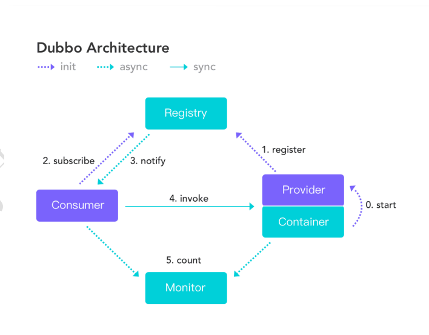
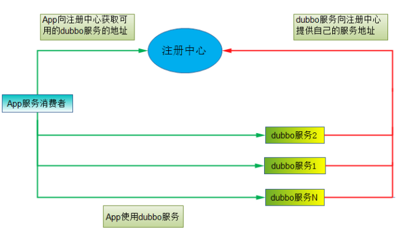
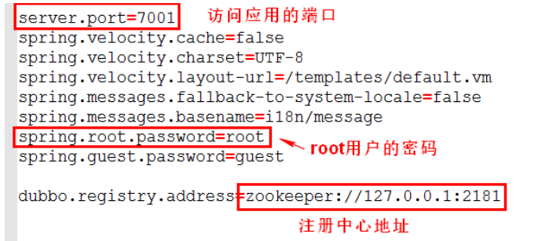

[toc]

# 前言

- ### 什么是分布式框架

  分布式系统是若干独立系统的结合，但是用户使用起来像是在使用一套系统 

- ### 为什么需啊哟分布式系统

  规模逐步扩大的业务和业务的复杂，单台计算机扛不住啥双十一那样的流量。

- ### 应用框架的发展演变

  单一框架

  - 当网站流量很小的时候，将所有的应用业务放到一台服务器上，打包运行公司管理系统或者市场收银系统
  - 优点：开发简单，不熟简单
  - 缺点：扩展不容易，很难处理日益增长的流量，谁都改一个服务器，维护难，性能难提升

  垂直应用架构

  - 将大应用拆分为小应用（一般按照业务拆分），根据不同的访问频率决定各自业务不熟的服务器数量
  - 优点：扩展容易
  - 缺点：页面一改，可能早晨给整个项目重新部署，业务和界面没有分离开，随着业务种类的增加，怎么解决业务之间的相互调用问题。

  分布式架构（基于RPC远程过程调用）

  - 将业务拆分后，用某种方式实现各个业务模块的远程调用和复用，这时一个好的RPC框架就决定了你的分布式架构的性能。当然若有实力的话，自己写一个也不是不行。

- ### Dubbo
  - 一个高性能的RPC框架，解决了分布式中的调用问题
  - 优点：解决了分布式系统中的调用问题
  - 缺点：用户服务器使用率小，这时候就要求我们还有一个统一管理的调度中心。


# PRC

## 认识PRC

- RPC 【Remote Procedure Call】是指远程过程调用，是一种进程间通信方式，是一种技 术思想，而不是规范。它允许程序调用另一个地址空间（网络的另一台机器上）的过程或函 数，而不用开发人员显式编码这个调用的细节。调用本地方法和调用远程方法一样。

- RPC 的实现方式可以不同。例如 java 的 rmi, spring 远程调用等。

- RPC 概念是在上世纪 80 年代由 Brue Jay Nelson(布鲁·杰伊·纳尔逊)提出。使用 PRC 可以 将本地的调用扩展到远程调用（分布式系统的其他服务器）。

- 特点

  1. 简单：使用简单，建立分布式应用更容易。 
  2. 高效：调用过程看起来十分清晰，效率高。 
  3. 通用：进程间通讯的方式，有通用的规则

  

## PRC基本原理

PRC 调用过程： 

1. 调用方 client 要使用右侧 server 的功能（方法），发起对方法的调用 
2. client stub 是 PRC 中定义的存根，看做是 client 的助手。stub 把要调用的方法参数进行序 列化，方法名称和其他数据包装起来。
3. 通过网络 socket(网络通信的技术)，把方法调用的细节内容发送给右侧的 server
4. server 端通过 socket 接收请求的方法名称，参数等数据，传给 stub。
5. server 端接到的数据由 serverstub(server 的助手)处理，调用 server 的真正方法，处理业务 
6. server 方法处理完业务，把处理的结果对象（Object）交给了助手，助手把 Object 进行序 列化，对象转为二进制数据。 
7. server 助手二进制数据交给网络处理程序 
8. 通过网络将二进制数据，发送给 client。 
9. client 接数据，交给 client 助手。 
10. client 助手，接收数据通过反序列化为 java 对象（Object），作为远程方法调用结果。


# Dubbo框架

## Dubbo概述

- Apache Dubbo (incubating) |ˈdʌbəʊ| 是一款高性能、轻量级的开源 Java RPC 框架，它提 供了三大核心能力：面向接口的远程方法调用，智能容错和负载均衡，以及服务自动注册和发现。 
- Dubbo 是一个分布式服务框架，致力于提供高性能和透明化的 RPC 远程服务调用方案、服 务治理方案。
- 官网：http://dubbo.apache.org


## Dubbo原理



- **服务提供者（Provider）**：暴露服务的服务提供方，服务提供者在启动时，想注册中心注册自己提供的服务。
- **服务消费者（Consumer）**：调用远程服务的服务消费方，服务消费者在启动时，想注册中心订阅自己所需要的服务，服务消费者，从提供者地址列表中基于软浮在均衡算法，选一台提供者进行调用，如果调用失败，再选另一条调用。
- **注册中心（Registry）**：注册中心返回服务提供者地址列表给消费者，如果有变更，注册中心将基于长连接推送变更数据给消费者
- **监控中心（Monitor）**：服务消费者和提供者，在内存中累计调用测试和调用时间，定时每分钟发送一次统计数据到监控中心

调用关系说明：

- 服务容器负责启动，加载，运行服务提供者
- 服务提供者在启动时，向注册中心注册自己提供的服务
- 服务消费者在启动时，向注册中心订阅自己所需的服务
- 注册中心返回服务提供者地址列表给消费者，如果有变更，注册中心将基于长连接推送变更数据给消费者。
- 服务消费者，从提供者地址列表中，结余软浮在均衡算法，选一台提供者进行调用，如果调用失败，再选择另一台调用。


## Dubbo支持的协议

- 支持多种协议：dubbo，hessian，rmi，http，webservice，thrift，memeached，redis。
- dubbo官方推荐使用dubbo协议，dubbo协议默认端口20880
- 使用dubbo协议，spring配置文件加入：`<dubbo:protocol name="dubbo" port="20880" />`


## 直连方式dubbo

点对点的直连项目:消费者直接访问服务提供者，没有注册中心。消费者必须指定服务 提供者的访问地址（url）。 

消费者直接通过 url 地址访问固定的服务提供者。这个 url 地址是不变的


# 注册中心（Zookeeper）

## 注册中心概述

- 对于服务提供方，它需要发布服务，而且由于应用系统的复杂性，服务的数量、类型也 不断膨胀；对于服务消费方，它最关心如何获取到它所需要的服务，而面对复杂的应用系统， 需要管理大量的服务调用。 
- 而且，对于服务提供方和服务消费方来说，他们还有可能兼具这两种角色，即需要提供 服务，有需要消费服务。 通过将服务统一管理起来，可以有效地优化内部应用对服务发布 /使用的流程和管理。服务注册中心可以通过特定协议来完成服务对外的统一。Dubbo 提供 的注册中心有如下几种类型可供选：
  - Multicast 注册中心：组播方式 
  - Redis 注册中心：使用 Redis 作为注册中心 
  - Simple 注册中心：就是一个 dubbo 服务。作为注册中心。提供查找服务的功能。 
  - Zookeeper 注册中心：使用 Zookeeper 作为注册中心
- 推荐使用zookeeper注册中心

## 注册中心的工作方式




## Zookeeper注册中心

- Zookeeper 是一个高性能的，分布式的，开放源码的分布式应用程序协调服务。简称 zk。 Zookeeper 是翻译管理是动物管理员。可以理解为 windows 中的资源管理器或者注册表。他 是一个树形结构。这种树形结构和标准文件系统相似。ZooKeeper 树中的每个节点被称为 Znode。和文件系统的目录树一样，ZooKeeper 树中的每个节点可以拥有子节点。每个节点表 示一个唯一服务资源。Zookeeper 运行需要 java 环境。

### 下载

官网下载地址: http://zookeeper.apache.org/

### 安装配置

- #### windows

  - 下载的文件 zookeeper-3.5.4-beta.tar.gz. 解压后到目录就可以了，例如 d:/servers/ zookeeper3.5.4 修改 zookeeper-3.5.4/conf/ 目录下配置文件，复制 zoo-sample.cfg 改名为 zoo.cfg
  - 配置信息
    - tickTime: 心跳的时间，单位毫秒. Zookeeper 服务器之间或客户端与服务器之间维持心跳的 时间间隔，也就是每个 tickTime 时间就会发送一个心跳。表明存活状态。 
    - dataDir: 数据目录，可以是任意目录。存储 zookeeper 的快照文件、pid 文件，默认为 /tmp/zookeeper，建议在 zookeeper 安装目录下创建 data 目录，将 dataDir 配置改 为/usr/local/zookeeper-3.4.10/data 
    - clientPort: 客户端连接 zookeeper 的端口，即 zookeeper 对外的服务端口，默认为 2181
  - 配置内容
    1. dataDir : zookeeper 数据的存放目录 
    2. admin.serverPort=8888 原因：zookeeper 3.5.x 【他的一个子服务】占用 8080

- #### Linux

  - Zookeeper 的运行需要 jdk。使用前 Linux 系统要安装好 jdk

  - 上传 zookeeper-3.5.4-beta.tar.gz.并解压 

    解压文件 zookeeper-3.5.4-beta.tar.gz. 

    执行命令：tar -zxvf zookeeper-3.5.4-beta.tar.gz. -C /usr/local/

  - 配置文件

    - 在 zookeeper 的 conf 目录下，将 zoo_sample.cfg 改名为 zoo.cfg，cp zoo_sample.cfg zoo.cfg zookeeper 启动时会读取该文件作为默认配置文件。

  - 进入 zookeeper 目录下的 conf

    - 拷贝样例文件 zoo-sample.cfg 为 zoo.cfg

  - 启动Zookeeper

    - （切换到安装目录的 bin 目录下）：./zkServer.sh start

  - 关闭Zookeeper

    - （切换到安装目录的 bin 目录下）：./zkServer.sh stop


## 注册中心的高可用

- 概念： 高可用性（High Availability）：通常来描述一个系统经过专门的设计，从而减少不能提供服 务的时间，而保持其服务的高度可用性。
  - Zookeeper 是高可用的，健壮的。Zookeeper 宕机，正在运行中的 dubbo 服务仍然可以正 常访问。
- 健壮性
  - 监控中心宕掉不影响使用，只是丢失部分采样数据
  - 注册中心仍能通过缓存提供服务列表查询，但不能注册新服务
  - 服务提供者无状态，任意一台宕掉后，不影响使用
  - 服务提供者全部宕掉后，服务消费者应用将无法使用，并无限次重连等待服务提供者恢复


# Dubbo配置

## 配置原则

在服务提供者配置访问参数。应为服务提供者更了解及服务的各种参数


## 关闭检查

- dubbo 缺省会在启动时检查依赖的服务是否可用，不可用时会抛出异常，阻止 Spring 初 始化完成，以便上线时，能及早发现问题，默认 check=true。通过 check="false"关闭检查， 
- 比如，测试时，有些服务不关心，或者出现了循环依赖，必须有一方先启动。
  - 例 1：关闭某个服务的启动时检查 
  - 例 2：关闭注册中心启动时检查 默认启动服务时检查注册中心存在并已运行。注册中心不启动会报错。


## 重试次数

- 消费者访问提供者，如果访问失败，则切换重试访问其它服务器，但重试会带来更长延迟。 访问时间变长，用户的体验较差。多次重新访问服务器有可能访问成功。可通过 retries="2"  来设置重试次数(不含第一次)。

  ```xml
  重试次数配置如下：
  <dubbo:service retries="2" />
  或
  <dubbo:reference retries="2" />
  ```


## 超时时间

- 由于网络或服务端不可靠，会导致调用出现一种不确定的中间状态（超时）。为了避免超时 导致客户端资源（线程）挂起耗尽，必须设置超时时间。 timeout：调用远程服务超时时间(毫秒）

- dubbo消费端

  ```xml
  指定接口超时配置
  <dubbo:reference interface="com.foo.BarService" timeout="2000" />
  ```

- dubbo服务端

  ```xml
  指定接口超时配置
  <dubbo:server interface="com.foo.BarService" timeout="2000" />
  ```


## 版本号

- 每个接口都应定义版本号，为后续不兼容升级提供可能。当一个接口有不同的实现，项目早 期使用的一个实现类， 之后创建接口的新的实现类。区分不同的接口实现使用 version。 特别是项目需要把早期接口的实现全部换位新的实现类，也需要使用 version
- 可以用版本号从早期的接口实现过渡到新的接口实现，版本号不同的服务相互间不引用。
- 可以按照以下的步骤进行版本迁移：
  - 在低压力时间段，先升级一半提供者为新版本 
  - 再将所有消费者升级为新版本 
  - 然后将剩下的一半提供者升级为新版本


# 监控中心

## 什么是监控中心

- dubbo 的使用，其实只需要有注册中心，消费者，提供者这三个就可以使用了，但是并不能 看到有哪些消费者和提供者，为了更好的调试，发现问题，解决问题，因此引入 dubbo-admin。 通过 dubbo-admin 可以对消费者和提供者进行管理。可以在 dubbo 应用部署做动态的调整， 服务的管理。
- dubbo-admin 
  - 图形化的服务管理页面；安装时需要指定注册中心地址，即可从注册中心中获取到所有的提 供者/消费者进行配置管理
- dubbo-monitor-simple
  - 简单的监控中心；


## 发布配置中心

- 下载监控中心：https://github.com/apache/incubator-dubbo-ops
  - 这里下载的是源码，需要手动编译

- 运行管理后台 dubbo-admin
  - 到 dubbo-admin-0.0.1-SNAPSHOT.jar 所在的目录。执行下面命令 java -jar dubbo-admin-0.0.1-SNAPSHOT.jar
- 修改配置 dubbo-properties文件
  - application.properties 文件，内容如下：
  - 

- 运行 dubbo-admin 应用
  1. 先启动注册中心 
  2. 执行提供者项目 
  3. java -jar dubbo-admin-0.0.1-SNAPSHOT.jar 启动 dubbo 管理后台 
  4. 在浏览器地址栏输入 http://localhost:7001 访问监控中心-控制台。
- 监控中心数据来源
  - dubbo.registry.address=zookeeper://127.0.0.1:2181
  - 监控中心的数据来自注册中心（Zookeeper）
- 通过浏览器，访问监控中心主页。点击菜单访问功能选项

