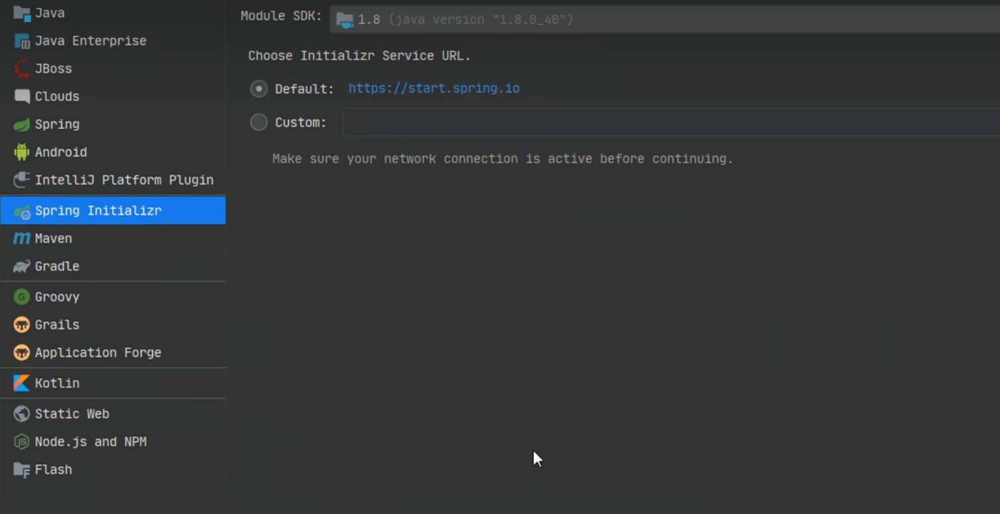
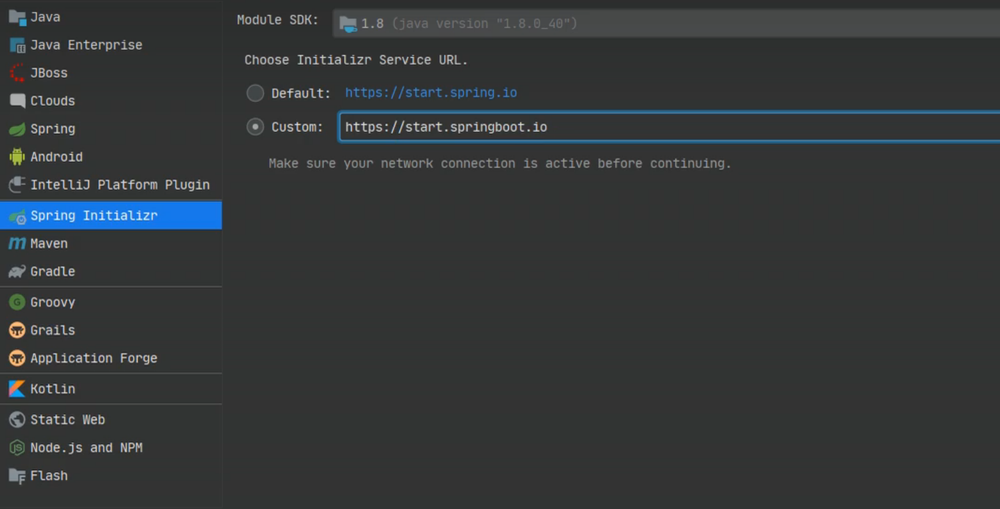
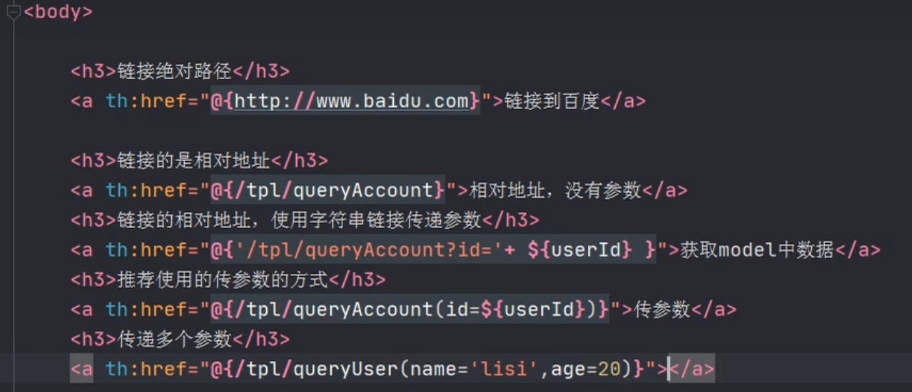

[TOC]

# 1-SpringBoot概述

- 为什么要使用SpringBoot？
  - 因为Spring，SpringMVC需要使用大量的配置文件，还需要配置各种对象，把使用的对象放入到Spring容器中才能使用对象，还需要了解其他的框架配置规则
  - SpringBoot就相当于不需要配置文件的Spring+SpringMVC。常用框架和第三方库已经配置好了，拿来用即可
  - SpringBoot开发效率更高，使用起来更方便
  - 在我看来，SpringBoot不像是框架，更像是一个启动器，帮你省去很多麻烦的启动器

## JavaConfig

JavaConfig：使用java类作为xml配置文件的替代， 是配置spring容器的纯java的方式。 在这个java类这可以创建java对象，把对象放入spring容器中（注入到容器）

- 要使用两个注解

  - @Configuration：放在一个类上面，表示这个类作为配置文件使用的
  - @Bean：声明对象，把对象注入到容器

  ```java
  例子：
  package com.bjpowernode.config;
  
  import com.bjpowernode.vo.Student;
  import org.springframework.context.annotation.Bean;
  import org.springframework.context.annotation.Configuration;
  
  /**
   * Configuration:表示当前类是作为配置文件使用的。 就是用来配置容器的
   *       位置：在类的上面
   *
   *  SpringConfig这个类就相当于beans.xml
   */
  @Configuration
  public class SpringConfig {
  
      /**
       * 创建方法，方法的返回值是对象。 在方法的上面加入@Bean
       * 方法的返回值对象就注入到容器中。
       *
       * @Bean: 把对象注入到spring容器中。 作用相当于<bean>
       *
       *     位置：方法的上面
       *
       *     说明：@Bean,不指定对象的名称，默认是方法名是 id
       *
       */
      @Bean
      public Student createStudent(){
          Student s1  = new Student();
          s1.setName("张三");
          s1.setAge(26);
          s1.setSex("男");
          return s1;
      }
  
  
      /***
       * 指定对象在容器中的名称（指定<bean>的id属性）
       * @Bean的name属性，指定对象的名称（id）
       */
      @Bean(name = "lisiStudent")
      public Student makeStudent(){
          Student s2  = new Student();
          s2.setName("李四");
          s2.setAge(22);
          s2.setSex("男");
          return s2;
      }
  }
  
  ```

## @ImportResource

@ImportResource作用导入其他的xml配置文件，等于在xml文件中使用：

```xml
<import resources="其他配置文件"/>
```

实际代码：

```java
@Configuration
@ImportResource(value ={ "classpath:applicationContext.xml","classpath:beans.xml"})
public class SpringConfig {
}
```


## @PropertyResource

@PropertyResource: 读取properties属性配置文件。 使用属性配置文件可以实现外部化配置 ，在程序代码之外提供数据。

步骤：

1. 在resources目录下，创建properties文件，使用k=v的格式提供数据
2. 在@PropertyResource指定properties
3. 使用@Value（value="${key}"）

resources目录下的properties文件

```properties
tiger.name=东北老虎
tiger.age=6
```

创建properties对应的数据类

```java
@Component("tiger")
public class Tiger {
 @Value("${tiger.name}")
 private String name;
```

SpringConfig文件类

```java
@Configuration
@ImportResource(value ={ "classpath:applicationContext.xml","classpath:beans.xml"})
@PropertySource(value = "classpath:config.properties")
@ComponentScan(basePackages = "com.bjpowernode.vo")
public class SpringConfig {
}
```


# 2-SpringBoot介绍

pringBoot是Spring中的一个成员， 可以简化Spring，SpringMVC的使用。 他的核心还是IOC容器。

官网：https://spring.io

**特点：**

- **Create stand-alone Spring applications**

  创建独立的spring应用

- **Embed Tomcat, Jetty or Undertow directly (no need to deploy WAR files)**

  内嵌的tomcat， jetty ， Undertow 

- **Provide opinionated 'starter' dependencies to simplify your build configuration**

  提供了starter起步依赖，简化应用的配置。   

  比如使用MyBatis框架 ， 需要在Spring项目中，配置MyBatis的对象 SqlSessionFactory ， Dao的代理对象

  在SpringBoot项目中，在pom.xml里面, 加入一个 mybatis-spring-boot-starter依赖

- **Automatically configure Spring and 3rd party libraries whenever possible**

  尽可能去配置spring和第三方库。叫做自动配置（就是把spring中的，第三方库中的对象都创建好，放到容器中， 开发人员可以直接使用）

- **Provide production-ready features such as metrics, health checks, and externalized configuration**

  提供了健康检查， 统计，外部化配置

- **Absolutely no code generation and no requirement for XML configuration**

  不用生成代码， 不用使用xml，做配置


## 2.2 创建SpringBoot项目

### 2.2.1：使用Spring提供的初始化器



通过该地址：[Spring Initializr (springboot.io)](https://start.springboot.io/)，可以实现在浏览器创建一个项目，选择所需依赖和创建需求之后，会以压缩包的形式发送到浏览器，解压在idea中添加项目即可使用，创建出来的项目工程和之前的是一样的。

### 2.2.2：使用自定义的国内地址

https://start.springboot.io



### 2.2.3：当然也可以直接创建Maven项目，然后自己补全文件


## 2.3 注解的使用

@SpringBootApplication【是一个复合注解，是由一下的注解复合而成】

- @SpringBootConfiguration
  - 使用了@SpringBootConfiguration注解标注的类，可以作为配置文件使用的，可以使用@Bean声明对象，注入到容器
- @EnableAutoConfiguration
  - 启用自动配置， 把java对象配置好，注入到spring容器中。例如可以把mybatis的对象创建好，放入到容器中
- @ComponentScan
  - 扫描器，找到注解，根据注解的功能创建对象，给属性赋值等等。
  - 默认扫描的包： @ComponentScan所在的类所在的包和子包。


## 2.4 SpringBoot的配置文件

- 配置文件名称： application

- 扩展名有： properties( k=v) ;  yml ( k: v)

- 使用application.properties；application.yml
- 例如使用配置文件配置端口号和项目名

```properties
#设置端口号
server.port=8082
#设置访问应用上下文路径， contextpath
server.servlet.context-path=/myboot
```

```yaml
server:
  port: 8083
  servlet:
    context-path: /myboot2
```


## 2.5 多环境配置

在实际开发过程中，项目会经历很多的阶段（开发—测试—上线），每个阶段的配置也会不同，例如端口，context根，数据库等等，那么这个时候为了方便在不同的环境直接切换，SpringBoot提供了多环境配置。

**为每个环境创建一个配置文件，名称必须以application-环境标识.properties/yml**

创建开发环境的配置文件：application-dev.properties（application-dev.yml）

创建测试者使用的配置：application-test.properties（application-test.yml）


## 2.6 @ConfigurationProperties

@ConfigurationProperties：把配置文件的数据映射为java对象。

属性：prefix 配置文件中的某些key的开头的内容。

```java
@Component
@ConfigurationProperties(prefix = "school")
public class SchoolInfo {

    private String name;

    private String website;

    private String address;


    public String getName() {
        return name;
    }

    public void setName(String name) {
        this.name = name;
    }

    public String getWebsite() {
        return website;
    }

    public void setWebsite(String website) {
        this.website = website;
    }

    public String getAddress() {
        return address;
    }

    public void setAddress(String address) {
        this.address = address;
    }

    @Override
    public String toString() {
        return "SchoolInfo{" +
                "name='" + name + '\'' +
                ", website='" + website + '\'' +
                ", address='" + address + '\'' +
                '}';
    }
}

```


application.properties

```properties
#配置端口号
server.port=8082
#context-path
server.servlet.context-path=/myboot

#自定义key=value
school.name=动力节点
school.website=www.bjpowernode.com
school.address=北京的大兴区

site=www.bjpowernode.com
```

这里注意一下：properties默认不是utf-8字符集，响应回浏览器的时候会出现乱码，这里可以使用yaml文件格式，可以设置成utf-8

```yaml
#配置端口号和text-path
server:
	port: 8082
	servlet:
		ontext-path: /boot

#自定义key=value
school:
	name: 动力节点
	website: www.bjpowernode.com
	address: 北京的大兴区
site: www.bjpowernode.com
```


## 2.7 使用jsp

事先说明，SpringBoot不推荐使用jsp，而是用模板技术（Thymeleaf，freemarker）代替jsp

当然，造火箭，会还是得会的


想要使用jsp需要配置：

1. 加入处理jsp的依赖，负责编译jsp

   ```xml
   <dependency>
       <groupId>org.apache.tomcat.embed</groupId>
       <artifactId>tomcat-embed-jasper</artifactId>
   </dependency>
   ```

2. 如果需要使用servlet， jsp，jstl的功能，则需要再添加各自的依赖

   ```xml
   <dependency>
   	<groupId>javax.servlet</groupId>
   	<artifactId>jstl</artifactId>
   </dependency>
   
   <dependency>
   	<groupId>javax.servlet</groupId>
   	<artifactId>javax.servlet-api</artifactId>
   </dependency>
   
   <dependency>
   <groupId>javax.servlet.jsp</groupId>
   	<artifactId>javax.servlet.jsp-api</artifactId>
   	<version>2.3.1</version>
   </dependency>
   
   ```

3. 创建一个存放jsp的目录

4. 需要再pom.xml文件中指定jsp文件编译后存放的目录

   ```xml
   <resources>
   	<resource>
           <!-- jsp原来的目录 -->
           <directory>src/main/webapp</directory>  
           <!-- 指定编译后的存放目录 -->
           <targetPath>META-INF/resources</targetPath>
           <!-- 指定指定处理的目录的文件 -->
           <includes>
           	<include>**/.*</include>
           </includes>
   	</resource>
   </resources>
   ```

5. 在application.properties/yml文件中配置视图解析器

   ```properties
   #配置端口号
   server.port=9090
   server.servlet.context-path=/mybot
   
   #配置视图解析器
   #/ = src/main/webapp
   spring.mvc.view.prefix=/
   spring.mvc.view.suffix=.jsp
   
   ```

6. 创建Controller，访问jsp


## 2.8 使用容器

想通过代码，从容器总获取对象。

主方法中，SpringApplication.run(Application.class, args);这个方法的返回值就是容器对象

```java
public static ConfigurableApplicationContext run(Class<?> primarySource, String... args) {
        return run(new Class[]{primarySource}, args);
}

ConfigurableApplicationContext : 接口，是ApplicationContext的子接口
public interface ConfigurableApplicationContext extends ApplicationContext
```


## 2.9 CommandLineRunner接口和ApplicationRunner接口

这两个接口都 有一个run方法。 执行时间在容器对象创建好后， 自动执行run（）方法。

可以完成自定义的在容器对象创建好的一些操作。

```java
@FunctionalInterface
public interface CommandLineRunner {
    void run(String... args) throws Exception;
}

@FunctionalInterface
public interface ApplicationRunner {
    void run(ApplicationArguments args) throws Exception;
}
```


# 3-SpringBoot和web组件

主要学3个东东：拦截器，Servlet，Filter

## 3.1 SpringBoot拦截器

拦截器是SpringMVC中一种对象，能拦截对Controller的请求。

拦截器框架中有系统的拦截器，还可以自定义拦截器，实现对请求预先处理


#### 回顾之前使用SpringMVC

实现自定义拦截器：

1. 创建类实现SpringMVC卡u跟你讲唉的HandlerInterceptor接口

   ```java
   public interface HandlerInterceptor {
    default boolean preHandle(HttpServletRequest request, HttpServletResponse response, Object handler) throws Exception {
        return true;
    }
   
    default void postHandle(HttpServletRequest request, HttpServletResponse response, Object handler, @Nullable ModelAndView modelAndView) throws Exception {
    }
   
    default void afterCompletion(HttpServletRequest request, HttpServletResponse response, Object handler, @Nullable Exception ex) throws Exception {
    }
   }
   ```

2. 需要在SpringMVC的配置文件中，声明拦截器

   ```xml
   <mvc:interceptors>
   	<mvc:interceptor>
       	<mvc:path="url" />
           <bean class="拦截器类全限定名称"/>
       </mvc:interceptor>
   </mvc:interceptors>
   ```


#### SpringBoot拦截器

```java
@Configuration
public class MyAppConfig implements WebMvcConfigurer {

    //添加拦截器对象， 注入到容器中
    @Override
    public void addInterceptors(InterceptorRegistry registry) {

        //创建拦截器对象
        //这里创建的拦截器对象只能用new创建，不能使用注解或者注入。因为注解只能修饰成员变量或者构造方法的set方法
        HandlerInterceptor interceptor = new LoginInterceptor();

        //指定拦截的请求uri地址
        String path []= {"/user/**"};
        //指定不拦截的地址
        String excludePath  [] = {"/user/login"};
        registry.addInterceptor(interceptor)
                .addPathPatterns(path)//拦截的地址
                .excludePathPatterns(excludePath);//除外的地址

    }
}
```


## 3.2 SprongBoot的Servlet

在SpringBoot框架中使用Servlet对象

使用步骤：

1. 创建servlet类，创建类继承HttpServlet
2. 注册Servlet，让框架找到Servlet

创建Servlet

```java
//创建Servlet类
public class MyServlet extends HttpServlet {
    @Override
    protected void doGet(HttpServletRequest req, HttpServletResponse resp) throws ServletException, IOException {
        doPost(req,resp);
    }

    @Override
    protected void doPost(HttpServletRequest req, HttpServletResponse resp) throws ServletException, IOException {
       //使用HttpServletResponse输出数据，应答结果
        resp.setContentType("text/html;charset=utf-8");
        PrintWriter out  = resp.getWriter();
        out.println("===执行的是Servlet==");
        out.flush();
        out.close();

    }
}
```

注册servlet

```java
@Configuration
public class WebApplictionConfig {

    //定义方法， 注册Servlet对象
    @Bean
    public ServletRegistrationBean servletRegistrationBean(){

        //public ServletRegistrationBean(T servlet, String... urlMappings)
        //第一个参数是 Servlet对象， 第二个是url地址

        //ServletRegistrationBean bean =
                //new ServletRegistrationBean( new MyServlet(),"/myservlet");


        ServletRegistrationBean bean = new ServletRegistrationBean();
        bean.setServlet( new MyServlet());
        bean.addUrlMappings("/login","/test"); // <url-pattern>


        return bean;
    }
}
```

## 3.3 过滤器Filter

Filter是Servlet规范中的过滤器，可以处理请求， 对请求的参数， 属性进行调整。 常常在过滤器中处理字符编码

框架中使用过滤器：

1. 创建自定义过滤器类
2. 注册Filter过滤器对象


床架自定义过滤器类

```java
// 自定义过滤器
public class MyFilter implements Filter {
    @Override
    public void doFilter(ServletRequest servletRequest, ServletResponse servletResponse, FilterChain filterChain) throws IOException, ServletException {
        System.out.println("执行了MyFilter，doFilter ");
        filterChain.doFilter(servletRequest,servletResponse);
    }
}
```

注册Filter

```java
@Configuration
public class WebApplicationConfig {

    @Bean
    public FilterRegistrationBean filterRegistrationBean(){
        FilterRegistrationBean bean  = new FilterRegistrationBean();
        bean.setFilter( new MyFilter());
        bean.addUrlPatterns("/user/*");
        return bean;
    }
}
```


## 3.4 字符集过滤器

CharacterEncoding：解决post请求中乱码的问题

在SpringMVC框架，在web.xml注册过滤器，配置他的属性

**事先说明，常用的，也是更简单的方法是，直接只使用配置文件进行修改，也就是第二种方法**

第一种方式：

1. 配置字符集过滤器

   ```java
   @Configuration
   public class WebSystemConfig {
   
       //注册Servlet
       @Bean
       public ServletRegistrationBean servletRegistrationBean(){
           MyServlet myServlet = new MyServlet();
           ServletRegistrationBean reg = new ServletRegistrationBean(myServlet,"/myservlet");
           return reg;
       }
   
   
       //注册Filter
       @Bean
       public FilterRegistrationBean filterRegistrationBean(){
           FilterRegistrationBean reg = new FilterRegistrationBean();
   
           //使用框架中的过滤器类
           CharacterEncodingFilter filter  = new CharacterEncodingFilter();
           //指定使用的编码方式
           filter.setEncoding("utf-8");
           //指定request ， response都使用encoding的值
           filter.setForceEncoding(true);
   
           reg.setFilter(filter);
           //指定 过滤的url地址
           reg.addUrlPatterns("/*");
   
   
           return reg;
       }
   }
   ```

2. 修改application.properties文件，让自定义过滤器起作用

   ```properties
   #SpringBoot中默认已经配置了CharacterEncodingFilter。 编码默认ISO-8859-1
   #设置enabled=false 作用是关闭系统中配置好的过滤器， 使用自定义的CharacterEncodingFilter
   server.servlet.encoding.enabled=false
   ```

第二种方式【直接修改配置文件】：

```properties
server.port=9001
server.servlet.context-path=/myboot

#让系统的CharacterEncdoingFilter生效
server.servlet.encoding.enabled=true
#指定使用的编码方式
server.servlet.encoding.charset=utf-8
#强制request，response都使用charset属性的值
server.servlet.encoding.force=true
```


# 4-SpringBoot集成Mybatis

## 实现步骤：

1. mybatis起步依赖：完成mybatis对象自动配置，对象放在容器中

2. pom.xml指定吧src/main/java目录中的xml文件包含到classpath中

3. 创建Student实体类

4. 创建DAO接口StudentDao，创建一个查询学生的方法

5. 创建DAO接口对应的Mapper文件，xml文件，写sql语句

6. 穿啊进SErvice层赌侠ing，创建SutdentService层接口和他的实现类。去dao对象方法。完成数据库的操作

7. 创建Controller对象，访问Service

8. 写application.properties（yml）文件配置数据库的连接信息

   ```yaml
   server:
     port: 9001
     servlet:
       context-path: /orm
   
   #连接数据库
   spring:
     datasource:
       driver-class-name: com.mysql.cj.jdbc.Driver
       url: jdbc:mysql://localhost:3306/ssm?useUnicode=true&characterEncoding=UTF-8&serverTimezone=GMT%2B8
       username: root
       password: 159357
   
   ```

   

### 方式一：@Mapper

@Mapper：放在mapper层接口上面

作用是告诉MyBatis这是dao接口，创建此接口的代理对象

```java
/**
 * 告诉Mybatis这是mapper接口，创建次借口的代理对象
 */
@Mapper
public interface StudentMapper {
    Student selectById( @Param("stuId") Integer id);
}

```


### 方式二：@MapperScan

在配置类中使用该注解，并写对应的包地址即可，方便

```java
@SpringBootApplication
@MapperScan(basePackages = "xyz.welt.mapper")//这是一个数组，可以添加多个地址
public class Springboot005Application {

    public static void main(String[] args) {
        SpringApplication.run(Springboot005Application.class, args);
    }

}
```


### 方式三：Mapper文件和Mapper接口分开管理

现在吧Mapper文件放在resources目录下

1. 在resources目录中创建子目录（自定义的）

2. 吧mapper文件放到改目录中

3. 在application文件中指定mapper文件的目录

   ```yaml
   #指定mapper.xml文件的位置
   mybatis:
     mapper-locations: classpath:mapper/*.xml
     #指定mybatis日志
     configuration:
       log-impl: org.apache.ibatis.logging.stdout.StdOutImpl
   ```

4. 修改pom文件中指定在resources目录中的文件，编译到目标目录中（当然默认也是编译resources目录）

   ```xml
   <resources>
   	<resource>
       	<directory>src/main/java</directory>
           <includes>
          		 <include>**/*.xml</include>
                <include>**/*.properties</include>
                <include>**/*.yml</include>
           </includes>
       </resource>
       <resource>
           <directory>src/main/resources</directory>
           <includes>
           	<include>**/*.xml</include>
           	<include>**/*.properties</include>
           	<include>**/*.yml</include>
           </includes>
           </resource>
        </resources>
   ```

**主要使用这个方式，条理清晰，Java文件和xml文件分离，处理方便**


## Springboot事务

Spring框架中的事务

1. 管理事务的对象：事务管理器（一接口，内有很多实现类）

2. 声明式事务：在xml配置文件或者使用注解说明事务控制的内容

   控制事务：隔离级别，传播行为，超时时间

3. 事务处理方式：

   1. Spring框架中的@Transactional
   2. aspectj框架可以在xml配置文件中，声明事务控制的内容


SpringBoot中使用事务：上面两种方式都可以使用

1. 在业务方法的上面加入@Transactional，加入注解后，方法就有事务的功能了，
2. 明确的在主启动类的上面，加入@EnableTransactionManager

```java
/**
 * @Transactional: 表示方法的有事务支持
 *       默认：使用库的隔离级别， REQUIRED 传播行为； 超时时间  -1
 *       抛出运行时异常，回滚事务
 */
@Transactional
@Override
public int addStudent(Student student) {
    System.out.println("业务方法addStudent");
    int rows  =  studentDao.insert(student);
    System.out.println("执行sql语句");

    //抛出一个运行时异常， 目的是回滚事务
    //int m   = 10 / 0 ;

    return rows;
}
```


# 5-接口架构风格（RESTful）

## RESTful架构风格

1. REST :  （英文： Representational State Transfer , 中文： 表现层状态转移)。

   - 一种互联网软件架构设计的风格，但它并不是标准。
   - 基于这种理念和原则设计的接口可以更简洁，更有层次，REST 这个词，是 Roy Thomas Fielding 在他 2000 年的博士论文中提出的。

2. REST原则：

   - 如果一个架构复合REST原则，就称他为RESTFul架构
   - 最直接的风格改变是访问的URL地址
     - 普通访问http地址：http://localhost:8080/boot/order?id=1021&status=1
     - RESTFul风格的http地址：http://localhost:8080/boot/order/1021/1

3. RESTful风格的优点：

   - 轻量：只额吉基于http，不再需要任何别的注入消息协议，直接用get/post/put/delete这里发送请求的方式来代表CRUD操作
   - 面向资源：一目了然，方便理解
   - 数据描述简单，一般以xml，json作为数据交换媒介
   - 无状态，在调用一个接口（访问，操作资源的时候），可以不用考虑上下文，不用考虑当前状态，极大降低了复杂度
   - 简单，低耦合。

4. RESTful的注解

   在SpringBoot开发中，使用RESTful风格主要是用以下几个注解实现的

   1.  @PathVariable 
       - 获取url中的数据，**该注解是实现RESTful风格的最主要的一个注解**
   2.  @GetMapping
       - 接收GET方式的请求
       - 等同于 @RequestMapping( method=RequestMethod.GET)
   3.  @PostMapping
       - 接收和处理Post方式的请求
       - 等同于 @RequestMapping( method=RequestMethod.POST)
   4.  @PutMapping 
       - 接收put方式的请求，可以使用postMapping代替
       - 等同于 @RequestMapping( method=RequestMethod.PUT)
   5.  @DeleteMapping 
       - 接收delete方式的请求，可以使用GetMapping代替
       - 等同于 @RequestMapping( method=RequestMethod.DELETE)
   6.  @RestController
       - 符合注解， 是@Controller 和@ResponseBody组合。
       - 在类的上面使用@RestController ， 表示当前类者的所有方法都加入了 @ResponseBody

   

5. 总结：

   1. 增 post 请求、删 delete 请求、改 put 请求、查 get 请求

   2. 请求路径不要出现动词  例如：

      - 查询订单接口 /boot/order/1021/1（推荐）

      - /boot/queryOrder/1021/1（不推荐）

   3. 分页、排序等操作，不需要使用斜杠传参数

   4. 注意配置application.properties(yml)文件

      ```properties
      启用 HiddenHttpMethodFilter 这个过滤器， 支持 post 请求转为 put，delete
      spring.mvc.hiddenmethod.filter.enabled=true
      ```

      

# 6-SpringBoot集成Redis

Redis是一个NoSQL数据库，常作用缓存Cache使用。通过Redis客户端可以使用多种语言在程序中，访问Redis数据。Java语言中使用的客户端有Jedis，lettuce，Redisson等

​	Springboot中使用RedisTrmplate（StringRedisTrmplate）模板类操作Redis数据

Reids的数据类型有：String，hash，set，zset，list

Redis是一个中间件：是一个独立的服务器

JAVA中比较著名的客户端：Jedis，lettuce，Redisson


## 依赖

RedisTemplate使用的lettuce客户端库

```xml
<!--redis起步依赖：直接在项目中使用RedisTemplate（StringRedisTemplate）-->
<dependency>
	<groupId>org.springframework.boot</groupId>
    <artifactId>spring-boot-starter-data-redis</artifactId>
</dependency>
```

在程序中使用RedisTemplate类的方法操作Reids数据，实际其实是调用的lettuce客户端中的方法


## 对比StringRedisTemplate和RedisTemplate

StringRedisTemplate ： 把k，v 都是作为String处理， 使用的是String的序列化 ， 可读性好

RedisTemplate ： 把k，v 经过了序列化存到redis。 k，v 是序列化的内容， 不能直接识别.

​                                 默认使用的jdk序列化， 可以修改为前提的序列化


 序列化：把对象转化为可传输的字节序列过程称为序列化。

反序列化：把字节序列还原为对象的过程称为反序列化。


为什么需要序列化

序列化最终的目的是为了对象可以跨平台存储，和进行网络传输。而我们进行跨平台存储和网络传输的方式就是IO，而我们的IO支持的数据格式就是字节数组。我们必须在把对象转成字节数组的时候就制定一种规则（序列化），那么我们从IO流里面读出数据的时候再以这种规则把对象还原回来（反序列化）。


什么情况下需要序列化

通过上面我想你已经知道了凡是需要进行“跨平台存储”和”网络传输”的数据，都需要进行序列化。

本质上存储和网络传输 都需要经过 把一个对象状态保存成一种跨平台识别的字节格式，然后其他的平台才可以通过字节信息解析还原对象信息。


序列化的方式

序列化只是一种拆装组装对象的规则，那么这种规则肯定也可能有多种多样，比如现在常见的序列化方式有：

JDK（不支持跨语言）、JSON、XML、Hessian、Kryo（不支持跨语言）、Thrift、Protofbuff、


Student( name=zs, age=20)   ----  { "name":"zs", "age":20 }


java的序列化： 把java对象转为byte[], 二进制数据

json序列化：json序列化功能将对象转换为 JSON 格式或从 JSON 格式转换对象。例如把一个Student对象转换为JSON字符串{"name":"李四", "age":29} )，反序列化(将JSON字符串 {"name":"李四", "age":29} 转换为Student对象)


设置key或者value的序列化方式

```java
// 使用RedisTemplate ，在存取值之前，设置序列化
// 设置 key 使用String的序列化
redisTemplate.setKeySerializer( new StringRedisSerializer());

// 设置 value 的序列化
redisTemplate.setValueSerializer( new StringRedisSerializer());

redisTemplate.opsForValue().set(k,v);
```


# 7-SpringBoot集成Dubbo

github上大佬写的文档，便于理解的： https://github.com/apache/dubbo-spring-boot-project/blob/master/README_CN.md


## 7.1 公共模块

独立的Maven项目：定义了接口和数据实体类

tips：使用alt+回车实现自动序列化需要在设置里面设置

```java
//dubbo的实体类需要序列化
public class Student implements Serializable {
    private static final long serialVersionUID = 1901229007746699151L;

    private Integer id;
    private String name;
    private Integer age;
}

public interface StudentService {

    Student queryStudent(Integer id);
}

```


## 7.2 提供者（provider）

创建SpringBoot项目

1. pom.xml

   ```xml
   <dependencies>
   
      <!--加入公共模块的gav-->
      <dependency>
         <groupId>com.bjpowernode</groupId>
         <artifactId>022-interface-api</artifactId>
         <version>1.0.0</version>
      </dependency>
   
      <!--dubbo依赖-->
      <dependency>
         <groupId>org.apache.dubbo</groupId>
         <artifactId>dubbo-spring-boot-starter</artifactId>
         <version>2.7.8</version>
      </dependency>
   
   
      <!--zookeeper依赖-->
      <dependency>
         <groupId>org.apache.dubbo</groupId>
         <artifactId>dubbo-dependencies-zookeeper</artifactId>
         <version>2.7.8</version>
         <type>pom</type>
         <exclusions>
            <!-- 排除log4j依赖 -->
            <exclusion>
               <artifactId>slf4j-log4j12</artifactId>
               <groupId>org.slf4j</groupId>
            </exclusion>
         </exclusions>
      </dependency>
   </dependencies>
   ```

2. 实现公共模块的接口

   ```java
   /**
    * 使用dubbo中的注解暴露服务
    * @Component 可以不用加
    */
   @DubboService(interfaceClass = StudentService.class,version = "1.0",timeout = 5000)
   public class StudentServiceImpl implements StudentService {
       @Override
       public Student queryStudent(Integer id) {
           Student student  = new Student();
           if( 1001 == id){
               student.setId(1001);
               student.setName("------1001-张三");
               student.setAge(20);
           } else if(1002  == id){
               student.setId(1002);
               student.setName("#######1002-李四");
               student.setAge(22);
           }
   
           return student;
       }
   }
   ```

3. application.properties

   ```properties
   #配置服务名称 dubbo:application name="名称"
   spring.application.name=studentservice-provider
   
   #配置扫描的包， 扫描的@DubboService
   dubbo.scan.base-packages=com.bjpowernode.service
   
   #配置dubbo协议
   #dubbo.protocol.name=dubbo
   #dubbo.protocol.port=20881
   
   #注册中心
   dubbo.registry.address=zookeeper://localhost:2181
   ```

4. 启动类

   ```java
   @SpringBootApplication
   @EnableDubbo//这个一定得加上，代表你是在使用dubbo框架
   public class ProviderApplication {
   
      public static void main(String[] args) {
         SpringApplication.run(ProviderApplication.class, args);
      }
   }
   ```


## 7.3 消费者（customer）

和provider一样，customer也是创建SpringBoot项目

1. pom.xml

   ```xml
   <dependencies>
   
      <!--加入公共模块的gav-->
      <dependency>
         <groupId>com.bjpowernode</groupId>
         <artifactId>022-interface-api</artifactId>
         <version>1.0.0</version>
      </dependency>
   
      <!--dubbo依赖-->
      <dependency>
         <groupId>org.apache.dubbo</groupId>
         <artifactId>dubbo-spring-boot-starter</artifactId>
         <version>2.7.8</version>
      </dependency>
   
   
      <!--zookeeper依赖-->
      <dependency>
         <groupId>org.apache.dubbo</groupId>
         <artifactId>dubbo-dependencies-zookeeper</artifactId>
         <version>2.7.8</version>
         <type>pom</type>
         <exclusions>
            <!-- 排除log4j依赖 -->
            <exclusion>
               <artifactId>slf4j-log4j12</artifactId>
               <groupId>org.slf4j</groupId>
            </exclusion>
         </exclusions>
      </dependency>
   </dependencies>
   ```

2. 创建Controller（或者Service也行，这只是小实例）

   ```java
   @RestController
   public class DubboController {
   
       /**
        * 引用远程服务， 把创建好的代理对象，注入给studentService
        */
       //@DubboReference(interfaceClass = StudentService.class,version = "1.0")
   
       /**
        * 没有使用interfaceClass，默认的就是 引用类型的 数据类型
         */
       @DubboReference(version = "1.0")
       private StudentService studentService;
   
       @GetMapping("/query")
       public String queryStudent(Integer id){
           Student student   = studentService.queryStudent(id);
           return "调用远程接口，获取对象："+student;
       }
   }
   ```

3. application.properties

   ```properties
   #指定服务名称
   spring.application.name=consumer-application
   #指定注册中心
   dubbo.registry.address=zookeeper://localhost:2181
   ```

   

# 8-打包

## 8.1 war包

1. 创建了一个jsp应用

2. 修改pom.xml

3. 指定打包后的文件名称

```xml
<build>
   <!--打包后的文件名称-->
   <finalName>myboot</finalName>
</build>
```


4. 指定jsp编译目录

```xml
<!--resources插件， 把jsp编译到指定的目录-->
<resources>
   <resource>
      <directory>src/main/webapp</directory>
      <targetPath>META-INF/resources</targetPath>
      <includes>
         <include>**/*.*</include>
      </includes>
   </resource>

   <!--使用了mybatis ，而且mapper文件放在src/main/java目录-->
   <resource>
      <directory>src/main/java</directory>
      <includes>
         <include>**/*.xml</include>
      </includes>
   </resource>

   <!--把src/main/resources下面的所有文件，都包含到classes目录-->
   <resource>
      <directory>src/main/resources</directory>
      <includes>
         <include>**/*.*</include>
      </includes>
   </resource>
</resources>
```


5. 执行打包是war

```xml
<!--打包类型-->
<packaging>war</packaging>
```


​	6. 主启动类继承SpringBootServletInitializer

```java
/**
 * SpringBootServletInitializer: 继承这个类， 才能使用独立tomcat服务器
 */
@SpringBootApplication
public class JspApplication  extends SpringBootServletInitializer  {

   public static void main(String[] args) {
      SpringApplication.run(JspApplication.class, args);
   }

   @Override
   protected SpringApplicationBuilder configure(SpringApplicationBuilder builder) {
      return builder.sources(JspApplication.class);
   }
}
```


7. 部署war

   把war放到tomcat等服务器的发布目录中。  tomcat为例， myboot.war放到tomcat/webapps目录。

## 8.2 Jar包

1.创建了一个包含了jsp的项目

2.修改pom.xml

     1) 指定打包后的文件名称

```xml
<build>
   <!--打包后的文件名称-->
   <finalName>myboot</finalName>
</build>
```


  2) 指定springboot-maven-plugin版本

```xml
<plugins>
   <plugin>
      <groupId>org.springframework.boot</groupId>
      <artifactId>spring-boot-maven-plugin</artifactId>
      <!--打包jar， 有jsp文件时，必须指定maven-plugin插件的版本是 1.4.2.RELEASE-->
      <version>1.4.2.RELEASE</version>
   </plugin>
</plugins>
```


3）最后执行 maven clean package

       在target目录中，生成jar 文件， 例子是myboot.jar
    
       执行独立的springboot项目  在cmd中 java  -jar  myboot.jar


# 9-模板引擎（Thymeleaf）

Thymeleaf： 是使用java开发的模板技术， 在服务器端运行。 把处理后的数据发送给浏览器。

模板是作视图层工作的。  显示数据的。  Thymeleaf是基于Html语言。 Thymleaf语法是应用在html标签中 。 SpringBoot框架集成Thymealeaf,  使用Thymeleaf代替jsp。


Thymeleaf 的官方网站：http://www.thymeleaf.org
Thymeleaf 官方手册：https://www.thymeleaf.org/doc/tutorials/3.0/usingthymeleaf.html


## 9.1 表达式

1. 标准变量表达式 

   语法：  ${key} 

   作用： 获取key对于的文本数据，  key 是request作用域中的key ， 使用request.setAttribute(), model.addAttribute()

   在页面中的 html标签中， 使用 th:text="${key}" 

    ```html
    <div style="margin-left: 400px">
        <h3>标准变量表达式:  ${key}</h3>
        <p th:text="${site}">key不存在</p>
        <br/>
        <p>获取SysUser对象 属性值</p>
        <p th:text="${myuser.id}">id</p>
        <p th:text="${myuser.name}">姓名</p>
        <p th:text="${myuser.sex}">姓名：m男</p>
        <p th:text="${myuser.age}">年龄</p>
        <p th:text="${myuser.getName()}">获取姓名使用getXXX</p>
    </div>
    ```


2. 选择变量表达式（ 星号变量表达式）

   语法：  *{key}

   作用： 获取这个key对应的数据，   *{key}需要和th:object 这个属性一起使用。

   目的是简单获取对象的属性值。

   ```html
   <p>使用 *{} 获取SysUser的属性值</p>
   <div th:object="${myuser}">
       <p th:text="*{id}"></p>
       <p th:text="*{name}"></p>
       <p th:text="*{sex}"></p>
       <p th:text="*{age}"></p>
   
   </div>
   <p>使用*{}完成的表示 对象的属性值</p>
   <p th:text="*{myuser.name}" ></p>
   ```

   

3. 链接表达式

   语法： @{url}

   作用： 表示链接， 可以

   <script src="..."> , <link href="..."> <a href=".."> ,<form action="...">


   该表达式出现在th：地址类属性中，必须成对出现，例如属性是th:href，后面的地址就必须使用链接表达式

   

## 9.2  Thymeleaf属性

属性是放在html元素中的，就是html元素的属性，加入了th前缀。  属性的作用不变。    加入上th， 属性的值由模板引擎处理了。  在属性可以使用变量表达式

例如：

```xml
<form action="/loginServlet" method="post"></form>

<form th:action="/loginServlet" th:method="${methodAttr}"></form>
```


## 9.3 each

each循环， 可以循环List，Array

语法：

在一个html标签中，使用th:each

```xml
<div th:each="集合循环成员,循环的状态变量:${key}">
    <p th:text="${集合循环成员}" ></p>
</div>

集合循环成员,循环的状态变量:两个名称都是自定义的。 “循环的状态变量”这个名称可以不定义，默认是"集合循环成员Stat"
```

语法说明： th:each="user, iterStat : ${userlist}"中的 ${userList} 是后台传过来的集合 

- user 定义变量，去接收遍历${userList}集合中的一个数据 
  - iterStat  ${userList} 循环体的信息 
- 其中 user 及 iterStat 自己可以随便取名 
- interStat 是循环体的信息，通过该变量可以获取如下信息 
  - index: 当前迭代对象的 index（从 0 开始计算）
  - count: 当前迭代对象的个数（从 1 开始计算）这两个用的较多 
  - size: 被迭代对象的大小 
  - current: 当前迭代变量 
  - even/odd: 布尔值，当前循环是否是偶数/奇数（从 0 开始计算） 
  - first: 布尔值，当前循环是否是第一个 
  - last: 布尔值，当前循环是否是最后一个 
- 注意：循环体信息 interStat 也可以不定义，则默认采用迭代变量加上 Stat 后缀，即 userStat


each循环Map

在一个html标签中，使用th:each

```html
<div th:each="集合循环成员,循环的状态变量:${key}">
    <p th:text="${集合循环成员.key}" ></p>
    <p th:text="${集合循环成员.value}" ></p>
</div>

集合循环成员,循环的状态变量:两个名称都是自定义的。 “循环的状态变量”这个名称可以不定义，默认是"集合循环成员Stat"

key:map集合中的key
value：map集合key对应的value值

```


## 9.4 th:if

"th:if"  : 判断语句， 当条件为true， 显示html标签体内， 反之不显示 没有else语句

```xml
语法：
<div th:if=" 10 > 0 "> 显示文本内容 </div>

```


还有一个 th:unless  和 th:if相反的行为

```xml
语法：
<div th:unless=" 10 < 0 "> 当条件为false显示标签体内容 </div>
```


例子：if

```xml
<div style="margin-left: 400px">
        <h3> if 使用</h3>
        <p th:if="${sex=='m'}">性别是男</p>
        <p th:if="${isLogin}">已经登录系统</p>
        <p th:if="${age > 20}">年龄大于20</p>
        <!--""空字符是true-->
        <p th:if="${name}">name是“”</p>
        <!--null是false-->
        <p th:if="${isOld}"> isOld是null</p>
 </div>

```


例子： unless

```html
 <div style="margin-left: 400px">
        <h3>unless: 判断条件为false，显示标签体内容</h3>
        <p th:unless="${sex=='f'}">性别是男的</p>
        <p th:unless="${isLogin}">登录系统</p>
        <p th:unless="${isOld}"> isOld是null </p>
 </div>
```


## 9.5  th:switch

th:switch 和 java中的swith一样的

```html
语法：
<div th:switch="要比对的值">
    <p th:case="值1">
        结果1
    </p>
    <p th:case="值2">
        结果2
    </p>
    <p th:case="*">
        默认结果
    </p>
    以上的case只有一个语句执行
    
</div>
```


## 9.6 th:inline

1. 内联text：  在html标签外，获取表达式的值

   语法： 

   ```xml
   <p>显示姓名是：[[${key}]]</p>
   
    <div style="margin-left: 400px">
           <h3>内联 text, 使用内联表达式显示变量的值</h3>
           <div th:inline="text">
               <p>我是[[${name}]]，年龄是[[${age}]]</p>
               我是<span th:text="${name}"></span>,年龄是<span th:text="${age}"></span>
           </div>
   
           <div>
               <p>使用内联text</p>
               <p>我是[[${name}]],性别是[[${sex}]]</p>
           </div>
   </div>
   ```

   

2. 内联javascript

```html
例子：
 <script type="text/javascript" th:inline="javascript">
         var myname = [[${name}]];
         var myage = [[${age}]];

         //alert("获取的模板中数据 "+ myname + ","+myage)

        function fun(){
            alert("单击事件，获取数据 "+ myname + ","+ [[${sex}]])
        }
    </script>
```


## 9.7  字面量

例子：

```html
 <div style="margin-left: 400px">
       <h3>文本字面量: 使用单引号括起来的字符串</h3>
       <p th:text="'我是'+${name}+',我所在的城市'+${city}">数据显示</p>

       <h3>数字字面量</h3>
        <p th:if="${20>5}"> 20大于 5</p>

        <h3>boolean字面量</h3>
        <p th:if="${isLogin == true}">用户已经登录系统</p>

        <h3>null字面量</h3>
        <p th:if="${myuser != null}">有myuser数据</p>
    </div>
```


## 9.8  字符串连接

连接字符串有两种语法

1） 语法使用 单引号括起来字符串  ， 使用 + 连接其他的 字符串或者表达式

```html
  <p th:text="'我是'+${name}+',我所在的城市'+${city}">数据显示</p>
```

2）语法：使用双竖线， |字符串和表达式|

```html
<p th:text="|我是${name},我所在城市${city|">
    显示数据
</p>
```


例子：

```html
    <div style="margin-left: 400px">
       <h3>字符串连接方式1：使用单引号括起来的字符串</h3>
       <p th:text="'我是'+${name}+',我所在的城市'+${city}">数据显示</p>
        <br/>
        <br/>
        <h3>字符串连接方式2：|字符串和表达式|</h3>
        <p th:text="|我是${name},所在城市${city},其他人${myuser.name}|"></p>
    </div>
```


## 9.9 运算符

```xml
算术运 算： + , - - , * , / , %
关系比较 : > , < , >= , <= ( gt , lt , ge , le )
相等判断： == , != ( eq , ne )


<div style="margin-left: 400px">
        <h3>使用运算符</h3>
        <p th:text="${age > 10}">年龄大于 10 </p>
        <p th:text="${ 20 + 30 }">显示运算结果</p>
        <p th:if="${myuser == null}">myuser是null</p>
        <p th:if="${myuser eq null}">myuser是null</p>
        <p th:if="${myuser ne null}">myuser不是null</p>

        <p th:text="${isLogin == true ? '用户已经登录' : '用户需要登录'}"></p>
        <p th:text="${isLogin == true ? ( age > 10 ? '用户是大于10的' : '用户年龄比较小') : '用户需要登录'}"></p>

    </div>

三元运算符：
 表达式  ？ true的结果 : false的结果

三元运算符可以嵌套

```


## 9.10 内置对象

文档地址：https://www.thymeleaf.org/doc/tutorials/3.0/usingthymeleaf.html#web-context-namespaces-for-requestsession-attributes-etc.


#request 表示 HttpServletRequest

#session 表示 HttpSession对象

session 表示Map对象的， 是#session的简单表示方式， 用来获取session中指定的key的值

               #session.getAttribute("loginname") == session.loginname

这些是内置对象，可以在模板文件中直接使用。

```html
例子：
 <div style="margin-left: 350px">
        <h3>内置对象#request,#session，session的使用</h3>
        <p>获取作用域中的数据</p>
        <p th:text="${#request.getAttribute('requestData')}"></p>
        <p th:text="${#session.getAttribute('sessionData')}"></p>
        <p th:text="${session.loginname}"></p>

        <br/>
        <br/>
        <h3>使用内置对象的方法</h3>
        getRequestURL=<span th:text="${#request.getRequestURL()}"></span><br/>
        getRequestURI=<span th:text="${#request.getRequestURI()}"></span><br/>
        getQueryString=<span th:text="${#request.getQueryString()}"></span><br/>
        getContextPath=<span th:text="${#request.getContextPath()}"></span><br/>
        getServerName=<span th:text="${#request.getServerName()}"></span><br/>
        getServerPort=<span th:text="${#request.getServerPort()}"></span><br/>
</div>
```


##  9.11 内置工具类

内置工具类型： Thymeleaf自己的一些类，提供对string， date ，集合的一些处理方法

#dates: 处理日器的工具类

#numbers:处理数字的

#lists: 处理list集合的

```xml
<div style="margin-left: 350px">
      <h3>日期类对象 #dates</h3>
      <p th:text="${#dates.format(mydate )}"></p>
      <p th:text="${#dates.format(mydate,'yyyy-MM-dd')}"></p>
      <p th:text="${#dates.format(mydate,'yyyy-MM-dd HH:mm:ss')}"></p>
      <p th:text="${#dates.year(mydate)}"></p>
      <p th:text="${#dates.month(mydate)}"></p>
      <p th:text="${#dates.monthName(mydate)}"></p>
      <p th:text="${#dates.createNow()}"></p>
      <br/>

      <h3>内置工具类#numbers，操作数字的</h3>
      <p th:text="${#numbers.formatCurrency(mynum)}"></p>
      <p th:text="${#numbers.formatDecimal(mynum,5,2)}"></p>

      <br/>
      <h3>内置工具类#strings,操作字符串</h3>
      <p th:text="${#strings.toUpperCase(mystr)}"></p>
      <p th:text="${#strings.indexOf(mystr,'power')}"></p>
      <p th:text="${#strings.substring(mystr,2,5)}"></p>
      <p th:text="${#strings.substring(mystr,2)}"></p>
      <p th:text="${#strings.concat(mystr,'---java开发的黄埔军校---')}"></p>
      <p th:text="${#strings.length(mystr)}"></p>
      <p th:text="${#strings.length('hello')}"></p>
      <p th:unless="${#strings.isEmpty(mystr)}"> mystring 不是 空字符串  </p>

      <br/>
      <h3>内置工具类#lists,操作list集合</h3>
      <p th:text="${#lists.size(mylist)}"></p>
      <p th:if="${#lists.contains(mylist,'a')}">有成员a</p>
      <p th:if="!${#lists.isEmpty(mylist)}"> list 集合有多个成员</p>

      <br/>
      <h3>处理null</h3>
      <p th:text="${zoo?.dog?.name}"></p>

  </div>
```


## 9.12 自定义模板

模板是内容复用， 定义一次，在其他的模板文件中多次使用。

模板使用：

1.定义模板

2.使用模板

模板定义语法：

```html
th:fragment="模板自定义名称"

例如：
<div th:fragment="head">
    <p>
        动力节点-java开发
    </p>
    <p>
        www.bjpowernode.com
    </p>
</div>
```


引用模板语法：


```html
1) ~{templatename :: selector}
   templatename:  文件名称
   selector： 自定义模板名称
2）templatename :: selector
   templatename:  文件名称
   selector： 自定义模板名称

对于使用模板：有包含模板（th:include）， 插入模板(th:insert)
```


# 10-注解集合

## 创建对象的：

@Controller: 放在类的上面，创建控制器对象，注入到容器中

@RestController: 放在类的上面，创建控制器对象，注入到容器中。

- 作用：复合注解是@Controller , @ResponseBody, 使用这个注解类的，里面的控制器方法的返回值都是数据

@Service ： 放在业务层的实现类上面，创建service对象，注入到容器

@Repository : 放在dao层的实现类上面，创建dao对象，放入到容器。 没有使用这个注解，因为现在使用MyBatis框 架，  dao对象是MyBatis通过代理生成的。 不需要使用

@Repository、 所以没有使用。

@Component:  放在类的上面，创建此类的对象，放入到容器中。 


## 赋值的：

@Value ： 简单类型的赋值， 例如 在属性的上面使用`@Value("李四") private String name`还可					以使用@Value,获取配置文件者的数据（properties或yml）`@Value("${server.port}") private Integer port`

@Autowired: 引用类型赋值自动注入的，支持byName, byType. 默认是byType 。 放在属性的上面，也可以放在构造方法的上面。 推荐是放在构造方法的上面

@Qualifier:  给引用类型赋值，使用byName方式。   

@Autowird, @Qualifier都是Spring框架提供的。

@Resource ： 来自jdk中的定义， javax.annotation。 实现引用类型的自动注入， 支持byName, byType.默认是byName, 如果byName失败， 再使用byType注入。 在属性上面使用


## 其他：

@Configuration ： 放在类的上面，表示这是个配置类，相当于xml配置文件

@Bean：放在方法的上面， 把方法的返回值对象，注入到spring容器中。

@ImportResource ： 加载其他的xml配置文件， 把文件中的对象注入到spring容器中

@PropertySource ： 读取其他的properties属性配置文件

@ComponentScan： 扫描器 ，指定包名，扫描注解的

@ResponseBody: 放在方法的上面，表示方法的返回值是数据， 不是视图

@RequestBody : 把请求体中的数据，读取出来， 转为java对象使用。

@ControllerAdvice:  控制器增强， 放在类的上面， 表示此类提供了方法，可以对controller增强功能。

@ExceptionHandler : 处理异常的，放在方法的上面

@Transcational :  处理事务的， 放在service实现类的public方法上面， 表示此方法有事务


## SpringBoot中使用的注解

@SpringBootApplication ： 放在启动类上面， 包含了@SpringBootConfiguration，@EnableAutoConfiguration， @ComponentScan


## MyBatis相关的注解

@Mapper ： 放在类的上面 ， 让MyBatis找到接口， 创建他的代理对象

@MapperScan :放在主类的上面 ， 指定扫描的包， 把这个包中的所有接口都创建代理对象。 对象注入到容器中

@Param ： 放在dao接口的方法的形参前面， 作为命名参数使用的。

## Dubbo注解

@DubboService: 在提供者端使用的，暴露服务的， 放在接口的实现类上面

@DubboReference:  在消费者端使用的， 引用远程服务， 放在属性上面使用。

@EnableDubbo : 放在主类上面， 表示当前引用启用Dubbo功能。

